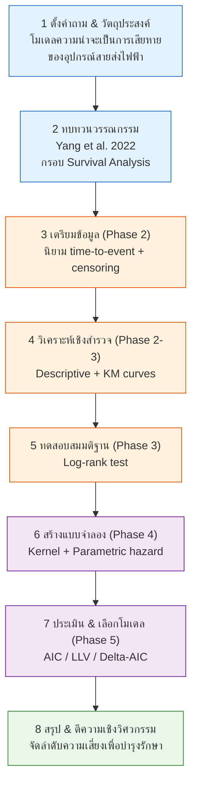
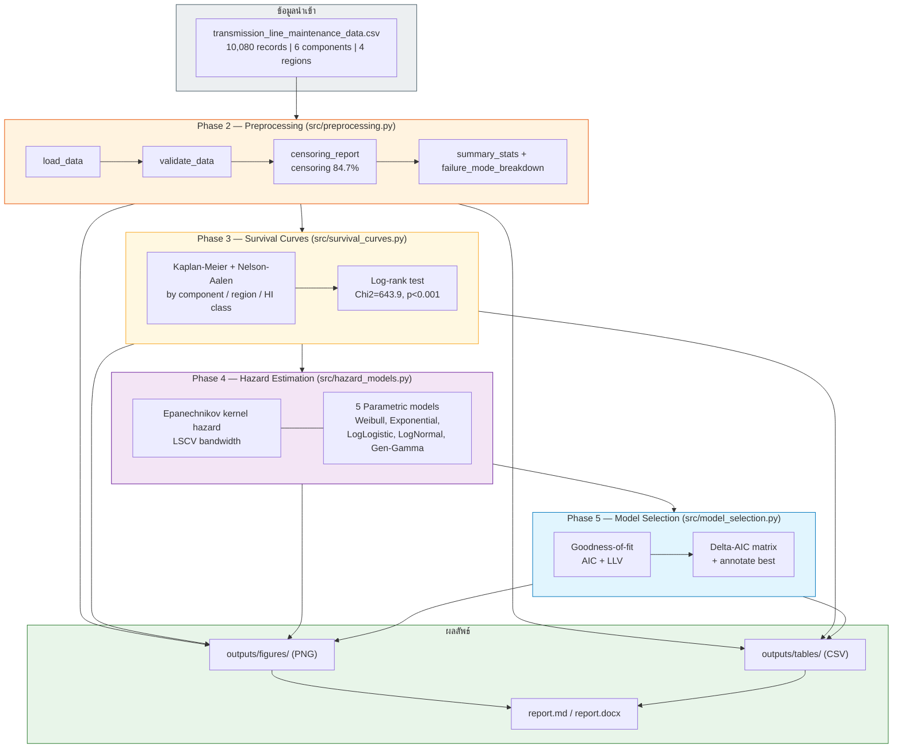
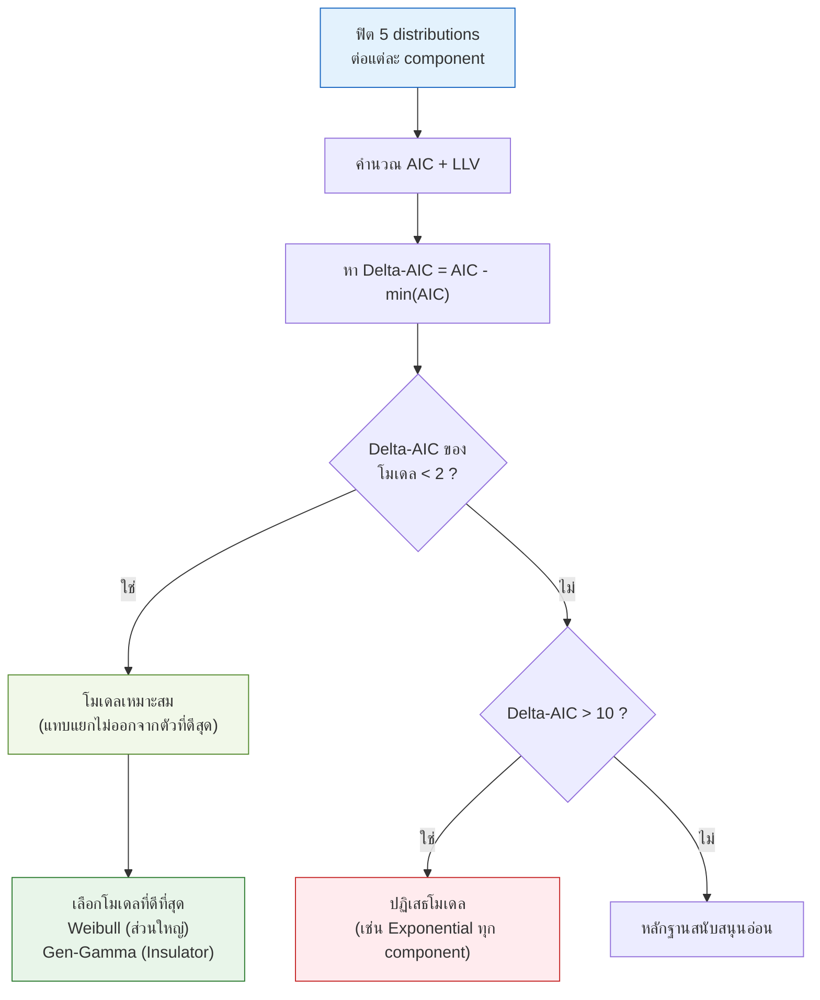

# Research Workflow — Transmission Line Predictive Maintenance (Survival Analysis)

แผนภาพขั้นตอนการทำวิจัย อ้างอิงระเบียบวิธีจาก Yang et al. (2022), *Scientific Reports*.

---

## 1. ภาพรวมขั้นตอนการวิจัย (Research Process)

---

## 2. รายละเอียด Pipeline (Data → Analysis → Results)

---

## 3. ตรรกะการตัดสินใจ — การเลือกโมเดล (Model Selection Logic)

---

## วิธีดูแผนภาพ
- **VSCode:** ติดตั้ง extension *Markdown Preview Mermaid Support* แล้วเปิด preview (Cmd+Shift+V)
- **GitHub:** เรนเดอร์ Mermaid อัตโนมัติเมื่อ push ไฟล์ `.md`
- **Export เป็นรูป:** วางโค้ดที่ [mermaid.live](https://mermaid.live) แล้วดาวน์โหลด PNG/SVG
