# การสร้างแบบจำลองเชิงพยากรณ์เพื่อการบำรุงรักษาเชิงพยากรณ์ของอุปกรณ์สายส่งไฟฟ้าแรงสูงด้วยการวิเคราะห์การอยู่รอด
# Prognostic Modeling of Predictive Maintenance Using Survival Analysis for High-Voltage Transmission Line Components

| | |
|---|---|
| **วันที่ / Date** | 2026-06-03 |
| **ระเบียบวิธีอ้างอิง / Methodology reference** | Yang et al. (2022). *"Prognostic modeling of predictive maintenance with survival analysis for mobile work equipment."* Scientific Reports, **12**, 8529. |
| **กลุ่มผู้อ่าน / Audience** | รายงานเทคนิคสำหรับ Senior Data Scientist / Senior Data Scientist technical report |
| **รูปแบบ / Format** | Bilingual (ภาษาไทย narrative + English technical terms) |
| **ข้อมูล / Data** | `data/transmission_line_maintenance_data.csv` — 10,080 rows (6 components × 1,680), 8 lines, 4 regions, 2018–2025 |

---

## สารบัญ / Table of Contents

**PART A — การวิเคราะห์ระดับประชากร / Population-Level Analysis**

1. บทนำและคำถามวิจัย / Introduction & Research Questions
2. ข้อมูลและนิยาม / Data & Definitions
3. ภาพรวมระเบียบวิธี / Methodology Pipeline
4. Phase 2 — การสำรวจและเตรียมข้อมูล / Exploratory Data Analysis & Preprocessing
5. Phase 3 — การอยู่รอดแบบนอนพาราเมตริก / Non-parametric Survival (KM / NA / log-rank)
6. Phase 4 — การประมาณอัตราความเสี่ยง / Hazard Estimation (kernel + parametric)
7. Phase 5 — การคัดเลือกแบบจำลอง / Model Selection (AIC)
8. Phase 6 — แบบจำลอง Cox Proportional Hazards / Cox PH Model

**PART B — การวิเคราะห์ระดับรายชิ้น / Individual-Level Analysis**

9. Phase 7 — แบบจำลอง Weibull AFT และ RUL / Weibull AFT Model & Remaining Useful Life
10. การเปรียบเทียบ Cox PH กับ Weibull AFT / Cox PH vs. Weibull AFT — Interplay

**บทสังเคราะห์ / Synthesis**

11. อภิปรายผล / Discussion
12. ข้อจำกัด / Limitations
13. สรุปและข้อเสนอแนะ / Conclusions & Recommendations
- ภาคผนวก / Appendix (ดัชนีตาราง, ดัชนีรูป, สูตรอ้างอิงของโมเดล / table index, figure index, per-model math reference)

---

---


## 1. บทนำและคำถามวิจัย / Introduction & Research Questions

### 1.1 บริบทของปัญหา / Problem Context

สายส่งไฟฟ้าแรงสูง (high-voltage transmission lines) เป็นโครงสร้างพื้นฐานวิกฤต (critical
infrastructure) ที่ประกอบด้วยอุปกรณ์ (components) หลายชนิดซึ่งเสื่อมสภาพและล้มเหลว (fail) ภายใต้
แรงกดดันจากสิ่งแวดล้อมและการใช้งานที่แตกต่างกัน ทั้งฟ้าผ่า (lightning) ความชื้น (humidity) มลพิษ
ฝุ่นละออง (PM2.5) ลม (wind) การรุกล้ำของพืชพรรณ (vegetation encroachment) และอายุการใช้งาน
สะสม กลยุทธ์การบำรุงรักษาแบบเดิมมักเป็นแบบ time-based (เปลี่ยนตามรอบเวลา) หรือ run-to-failure
(ใช้จนพัง) ซึ่งทั้งสองแบบไม่เหมาะกับสินทรัพย์ที่มีความเสี่ยงไม่เท่ากันในแต่ละจุด เป้าหมายของโครงการนี้
คือการย้ายจากกรอบคิดดังกล่าวไปสู่ **predictive maintenance** ที่ตัดสินใจบนพื้นฐานของความน่าจะเป็น
ของการล้มเหลว (failure probability) ในระดับ component แต่ละชิ้น

### 1.2 ทำไมจึงใช้ Survival Analysis / Why Survival Analysis

ข้อมูลบำรุงรักษามีลักษณะเฉพาะที่วิธีการถดถอยทั่วไป (ordinary regression / classification) จัดการได้ไม่ดี
นั่นคือ **right-censoring** — อุปกรณ์จำนวนมากยัง "ไม่ล้มเหลว" ณ เวลาสิ้นสุดการศึกษา (end of study)
เราจึงทราบเพียงว่า time-to-failure ของมัน "มากกว่า" เวลาที่สังเกตได้ แต่ไม่ทราบค่าจริง การทิ้งข้อมูล
เหล่านี้หรือถือว่าเป็น "ไม่ล้มเหลว" จะทำให้เกิด bias อย่างรุนแรง Survival analysis ออกแบบมาเพื่อใช้
ข้อมูล censored อย่างถูกต้องผ่านแนวคิดของ survival function S(t) และ hazard function h(t)
โดยตรง

โครงการนี้ยึดตามระเบียบวิธีของ **Yang et al. (2022). "Prognostic modeling of predictive
maintenance with survival analysis for mobile work equipment." Scientific Reports, 12, 8529.**
ซึ่งใช้ชุดเครื่องมือ: Kaplan-Meier, Nelson-Aalen, kernel hazard estimator (Epanechnikov),
parametric models (Weibull, Exponential, Log-logistic, Log-normal, Generalized-gamma) และ
ประเมินความเหมาะสมด้วย AIC และ Log-Likelihood Value (LLV) เราขยายกรอบนี้เพิ่มด้วย regression
สองตัว (Cox PH และ Weibull AFT) เพื่อ quantify ผลของ covariates และผลิต RUL ราย component

### 1.3 คำถามวิจัย / Research Questions & Objectives

โครงการนี้ตอบคำถามวิจัยหลัก 4 ข้อ:

1. **ประมาณ survival และ hazard รายชนิดอุปกรณ์ / Estimate survival & hazard per component**
   ประมาณค่า survival function S(t) และ hazard function h(t) สำหรับอุปกรณ์ทั้ง 6 ชนิด
   (Conductor, Damper, Spacer, Insulator, Fittings, Arrester) โดยใช้ทั้งวิธี non-parametric
   (Kaplan-Meier, Nelson-Aalen, kernel hazard) และระบุรูปร่างของ hazard (เพิ่มขึ้น/คงที่/ลดลง)

2. **เปรียบเทียบระหว่างอุปกรณ์และระหว่างภูมิภาค / Compare components & regions**
   ทดสอบทางสถิติว่า survival curves ของอุปกรณ์ต่างชนิด และของภูมิภาคต่างกัน (Northeast,
   North, Central, South) แตกต่างกันอย่างมีนัยสำคัญหรือไม่ ด้วย log-rank test (multivariate
   และ pairwise)

3. **เลือก parametric model ที่ดีที่สุด / Select best parametric model**
   fit distribution ทั้ง 5 ตระกูล (Weibull, Exponential, Log-logistic, Log-normal,
   Generalized-gamma) ราย component แล้วเลือกตัวที่เหมาะสมที่สุดด้วยเกณฑ์ AIC และ LLV
   (Phase 5)

4. **วัดผลของ covariates + ผลิต RUL รายชิ้นและ priority list / Quantify covariate effects +
   individual RUL & priority maintenance list**
   ประมาณผลของปัจจัยสิ่งแวดล้อม/สุขภาพ/การใช้งานที่มีต่อความเสี่ยงด้วย Cox Proportional
   Hazard (HR) และ Weibull AFT (Time Ratio / Acceleration Factor) จากนั้นพยากรณ์
   **Remaining Useful Life (RUL)** ราย component แต่ละชิ้น และจัดลำดับเป็น **priority
   maintenance list** สำหรับการตัดสินใจเชิงปฏิบัติการ

---

## 2. ข้อมูลและนิยาม / Data & Definitions

### 2.1 ภาพรวมชุดข้อมูล / Dataset Overview

- **ไฟล์ / File:** `data/transmission_line_maintenance_data.csv`
- **จำนวนแถว / Rows:** 10,080 แถว — หนึ่งแถวต่อหนึ่ง component ต่อหนึ่ง span (one row per
  component per span)
- **อุปกรณ์ / Components:** 6 ชนิด × 1,680 แถวต่อชนิด = 10,080 (Conductor, Damper, Spacer,
  Insulator, Fittings, Arrester)
- **สายส่ง / Lines:** 8 lines
- **ภูมิภาค / Regions:** 4 ภูมิภาค (Northeast, North, Central, South)
- **ช่วงเวลา / Period:** 2018–2025
- **จำนวนคอลัมน์ / Columns:** 43 คอลัมน์ (ตรวจสอบจาก CSV header โดยตรง)

### 2.2 นิยามหลักด้านการอยู่รอด / Core Survival Definitions

- **Time-to-event (`maintenance_period_days`)** — ระยะเวลาตั้งแต่ติดตั้ง (installation) จนถึง
  เหตุการณ์ (event) หรือจนถึงเวลาตัดข้อมูล (censoring) มีหน่วยเป็นวัน (days) เป็นแกนเวลา t ของ
  survival analysis
- **`event_occurred`** — ตัวบ่งชี้เหตุการณ์ (event indicator): `1` = เกิด failure (uncensored),
  `0` = **right-censored** คือยังไม่ล้มเหลว ณ เวลาที่สังเกต
- **Right-censoring** — สำหรับแถวที่ `event_occurred = 0` เราทราบเพียงว่า time-to-failure จริง
  > `maintenance_period_days` แต่ไม่ทราบค่าที่แท้จริง การประมาณทั้งหมดถูกออกแบบให้ใช้ข้อมูลนี้
  อย่างถูกต้อง (ไม่ทิ้ง และไม่นับเป็น failure)
- **อัตรา censoring / event โดยรวม / Overall censoring & event rate:** censoring rate =
  **84.65%**, event rate = **15.35%** (1,547 failures จาก 10,080 แถว) — ระดับ censoring สูง
  นี้คือเหตุผลสำคัญที่ต้องใช้ survival analysis แทน regression ปกติ

### 2.3 พจนานุกรมคอลัมน์ / Column Dictionary

ตารางต่อไปนี้ครอบคลุมทั้ง 43 คอลัมน์ในไฟล์ จัดกลุ่มตามบทบาท พร้อมความหมาย (ไทย + อังกฤษย่อ),
ชนิดข้อมูล (type), หน่วย (unit) และบทบาทในการวิเคราะห์ (role)

#### (ก) คอลัมน์ Survival / Survival Columns

| Column | ความหมาย (Thai + brief English) | Type | Unit | Role in analysis |
|---|---|---|---|---|
| `maintenance_period_days` | ระยะเวลาถึงเหตุการณ์ / time-to-event | int | days | **Duration (t)** — แกนเวลาหลักของทุกโมเดล |
| `event_occurred` | ตัวบ่งชี้เหตุการณ์ / 1=failure, 0=right-censored | int (0/1) | — | **Event indicator (δ)** |
| `component` | ชนิดอุปกรณ์ / component type | categorical | — | ตัวแปรจัดกลุ่มหลัก (stratify ทุก phase) |
| `failure_mode` | สาเหตุการล้มเหลว / failure cause (nullable เมื่อ censored) | categorical | — | EDA / failure-mode breakdown (ไม่เข้าโมเดล) |

#### (ข) Covariates สิ่งแวดล้อม / Environmental Covariates

| Column | ความหมาย (Thai + brief English) | Type | Unit | Role in analysis |
|---|---|---|---|---|
| `lightning_flash_density` | ความหนาแน่นฟ้าผ่า / lightning flash density | float | flashes/km²/yr | **Cox/AFT covariate** |
| `avg_wind_speed_ms` | ความเร็วลมเฉลี่ย / average wind speed | float | m/s | **Cox/AFT covariate** |
| `avg_humidity_pct` | ความชื้นเฉลี่ย / average relative humidity | float | % | **Cox/AFT covariate** |
| `pm25_annual_avg` | ค่าเฉลี่ยฝุ่น PM2.5 รายปี / annual mean PM2.5 | float | µg/m³ | **Cox/AFT covariate** |
| `coastal_proximity` | ระยะใกล้ชายฝั่ง / coastal proximity (inland/near_coast/coastal) | categorical | — | EDA / descriptive |
| `pollution_severity` | ระดับมลพิษ / pollution severity class (b/c/d) | categorical | — | EDA / descriptive |

#### (ค) Health Index

| Column | ความหมาย (Thai + brief English) | Type | Unit | Role in analysis |
|---|---|---|---|---|
| `HI_score_last` | คะแนนสุขภาพล่าสุด / latest health index score (0–5) | float | score 0–5 | **Cox/AFT covariate** (predictor หลัก) |
| `HI_class_last` | ชั้นสุขภาพล่าสุด / health index class (HI0–HI5) | categorical | — | จัดกลุ่ม KM (km_by_hi_class) |
| `HI_trend_per_year` | แนวโน้ม HI ต่อปี / HI trend per year | float | score/yr | EDA / descriptive |

#### (ง) Encroachment (การรุกล้ำแนวสายส่ง)

| Column | ความหมาย (Thai + brief English) | Type | Unit | Role in analysis |
|---|---|---|---|---|
| `encroachment_severity` | ระดับการรุกล้ำ / encroachment severity (none/minor/moderate/severe) | ordinal | mapped 0–3 | **Cox/AFT covariate** (เข้ารหัส ordinal 0–3) |
| `vegetation_encroachment` | การรุกล้ำของพืชพรรณ / vegetation encroachment flag | int (0/1) | — | EDA / descriptive |

#### (จ) Outage / Fault

| Column | ความหมาย (Thai + brief English) | Type | Unit | Role in analysis |
|---|---|---|---|---|
| `total_outage_events` | จำนวนเหตุไฟดับรวม / total outage events | int | count | EDA / descriptive |
| `fault_type_most_common` | ชนิด fault ที่พบบ่อยสุด / most common fault type | categorical | — | EDA / descriptive |
| `permanent_faults` | จำนวน fault ถาวร / permanent faults | int | count | EDA / descriptive |

#### (ฉ) Identifier / Operational Columns และคอลัมน์เสริมอื่น ๆ / Auxiliary Columns

| Column | ความหมาย (Thai + brief English) | Type | Unit | Role in analysis |
|---|---|---|---|---|
| `span_id` | รหัส span / span identifier | id (string) | — | Identifier (priority list) |
| `line_id` | รหัสสายส่ง / line identifier (8 lines) | id (string) | — | Identifier / grouping |
| `tower_id` | รหัสเสา / tower identifier | id | — | Identifier |
| `voltage_kv` | ระดับแรงดัน / line voltage | int | kV | **Cox/AFT covariate** |
| `region` | ภูมิภาค / region (NE/N/Central/South) | categorical | — | จัดกลุ่ม KM (km_by_region) |
| `installation_date` | วันที่ติดตั้ง / installation date | date | YYYY-MM-DD | คำนวณอายุ / priority list |
| `maintenance_date` | วันที่บำรุงรักษา / maintenance date (nullable) | date | YYYY-MM-DD | descriptive |
| `lightning_strikes_1km_annual` | ฟ้าผ่าในรัศมี 1 กม./yr / strikes within 1 km | float | strikes/yr | EDA / สิ่งแวดล้อมเสริม |
| `lightning_strikes_5km_annual` | ฟ้าผ่าในรัศมี 5 กม./yr / strikes within 5 km | float | strikes/yr | EDA / สิ่งแวดล้อมเสริม |
| `max_peak_current_kA` | กระแสยอดสูงสุดของฟ้าผ่า / max peak lightning current | float | kA | EDA |
| `lightning_caused_trip` | trip จากฟ้าผ่า / lightning-caused trip flag | int (0/1) | — | EDA |
| `avg_rainfall_mm_year` | ปริมาณฝนเฉลี่ยรายปี / annual average rainfall | float | mm/yr | EDA |
| `max_wind_speed_ms` | ความเร็วลมสูงสุด / max wind speed | float | m/s | EDA |
| `avg_temperature_c` | อุณหภูมิเฉลี่ย / average temperature | float | °C | EDA |
| `max_temperature_c` | อุณหภูมิสูงสุด / max temperature | float | °C | EDA |
| `temp_fluctuation_c` | ช่วงการแกว่งอุณหภูมิ / temperature fluctuation range | float | °C | EDA |
| `pm25_exceedance_days` | จำนวนวันที่ PM2.5 เกินมาตรฐาน / PM2.5 exceedance days | int | days/yr | EDA |
| `row_width_m` | ความกว้างแนวเขตสายส่ง / right-of-way width | float | m | EDA |
| `encroachment_events_total` | จำนวนเหตุการณ์รุกล้ำรวม / total encroachment events | int | count | EDA |
| `structure_encroachment` | การรุกล้ำของสิ่งปลูกสร้าง / structure encroachment flag | int (0/1) | — | EDA |
| `encroachment_caused_trip` | trip จากการรุกล้ำ / encroachment-caused trip flag | int (0/1) | — | EDA |
| `last_vegetation_cut_days` | จำนวนวันตั้งแต่ตัดพืชครั้งล่าสุด / days since last vegetation cut | int | days | EDA |
| `transient_faults` | จำนวน fault ชั่วคราว / transient faults | int | count | EDA |
| `mttr_hours` | เวลาเฉลี่ยในการซ่อม / mean time to repair | float | hours | EDA |
| `fault_to_failure_flag` | ธง fault ที่ลุกลามเป็น failure / fault-to-failure flag | int (0/1) | — | EDA |

### 2.4 ชุด Covariate 7 ตัวที่ใช้ในโมเดลถดถอย / The 7 Modeling Covariates

Cox PH (Phase 6) และ Weibull AFT (Phase 7) ใช้ covariate ชุดเดียวกัน 7 ตัว เพื่อให้ผลเทียบกันได้
โดยตรง (apples-to-apples) covariate เชิงตัวเลขถูก standardise ด้วย **z-score** จากสถิติของทั้ง
dataset (full-dataset mean/std) เพื่อให้ Hazard Ratio / Acceleration Factor เทียบกันได้ทั่วทั้ง
component และมีการเพิ่ม L2 penalizer = 0.1 เพื่อเสถียรภาพเชิงตัวเลข (numerical stability)

| # | Covariate | การเข้ารหัส / Encoding | หมายเหตุ |
|---|---|---|---|
| 1 | `lightning_flash_density` | z-score standardised | สิ่งแวดล้อม |
| 2 | `avg_wind_speed_ms` | z-score standardised | สิ่งแวดล้อม |
| 3 | `avg_humidity_pct` | z-score standardised | สิ่งแวดล้อม |
| 4 | `pm25_annual_avg` | z-score standardised | สิ่งแวดล้อม |
| 5 | `HI_score_last` | z-score standardised | predictor หลัก (มีนัยสำคัญทั้ง 6 component) |
| 6 | `encroachment_severity` | ordinal map none/minor/moderate/severe → 0/1/2/3, แล้ว standardise | เชิงลำดับ (ordinal) |
| 7 | `voltage_kv` | z-score standardised | เชิงปฏิบัติการ (operational) |

> หมายเหตุ: `coastal_proximity` และ `pollution_severity` เป็น categorical เชิงพรรณนาที่ใช้ใน EDA
> เท่านั้น ไม่ได้เข้า regression เพื่อหลีกเลี่ยง collinearity กับ covariate เชิงสิ่งแวดล้อมที่เป็นตัวเลข

---

## 3. ภาพรวมระเบียบวิธี / Methodology Pipeline

### 3.1 การไหลของ Pipeline แบบ Phase ต่อ Phase / Phase-to-Phase Flow

ระเบียบวิธีถูกจัดเป็นลำดับ phase ที่แต่ละขั้น **ป้อน (feed)** ผลให้ขั้นถัดไปอย่างมีตรรกะชัดเจน:

**Phase 2 — Preprocessing / EDA (`src/preprocessing.py`)**
โหลดและ validate ข้อมูล, สร้าง censoring report, summary statistics, failure-mode breakdown
และ covariate summary ขั้นนี้กำหนดความถูกต้องของ `maintenance_period_days` /
`event_occurred` ซึ่งเป็น input ของทุก phase ถัดไป และให้ context สำคัญคือ censoring rate
84.65% ที่กำหนดทิศทางทั้งหมด → ส่งต่อ duration และ event indicator ที่ตรวจสอบแล้วไปยัง Phase 3

**Phase 3 — Population Survival: KM / NA / log-rank (`src/survival_curves.py`)**
ประมาณ S(t) ด้วย **Kaplan-Meier (KM)** และ cumulative hazard H(t) ด้วย **Nelson-Aalen (NA)**
ราย component / region / HI class แล้วทดสอบความแตกต่างด้วย **log-rank test** (multivariate +
pairwise) → **NA increments (dH) เป็น input โดยตรงของ kernel hazard ใน Phase 4** ส่วน log-rank
ตอบ RQ ข้อ 2 (ความแตกต่างระหว่างกลุ่ม)

**Phase 4 — Hazard Shape: Kernel + Parametric (`src/hazard_models.py`)**
ใช้ **Epanechnikov kernel smoother** บน NA increments (จัดการ censoring ถูกต้อง) เลือก
bandwidth ด้วย **LSCV** (vectorised) เพื่อประมาณรูปร่างของ h(t) แบบ non-parametric พร้อมกับ
fit parametric 5 ตระกูลเพื่อเทียบรูปร่าง → **หลักฐานว่า hazard มีรูปร่าง monotonically decreasing
(ρ < 1) นี้เป็นแรงจูงใจให้ใช้ parametric regression ใน Phase 6–7** และยืนยันความเหมาะสมของตระกูล
Weibull

**Phase 5 — Model Selection: AIC (`src/model_selection.py`)**
สร้าง goodness-of-fit table (LLV + AIC) และ ΔAIC matrix ราย component × model เลือก
distribution ที่ดีที่สุดต่อ component → ผลว่า **Weibull ชนะ 5 ใน 6 component** (ยกเว้น Insulator
ที่ Generalized-gamma ดีที่สุดเล็กน้อย) ยืนยันการเลือกใช้ **Weibull AFT** เป็น regression หลักใน
Phase 7

**Phase 6 — Cox Proportional Hazard (`src/cox_model.py`)**
fit Cox PH ราย component ด้วย covariate 7 ตัว ให้ **Hazard Ratio (HR)** ตอบคำถาม *"หน่วยใด
เสี่ยงสูงกว่า ณ ปัจจุบัน?"* พร้อมตรวจสอบ **PH assumption** ด้วย Schoenfeld residuals test →
ระบุ covariate ที่มีนัยสำคัญ (HI_score_last มีนัยสำคัญทั้ง 6 component) ซึ่งชี้ทิศทางการตีความใน
Phase 7

**Phase 7 — Weibull AFT: RUL + Priority List (`src/aft_model.py`)**
fit **Weibull AFT** ด้วย covariate ชุดเดียวกัน ให้ **Time Ratio / Acceleration Factor (AF)**
ตอบคำถาม *"แต่ละปัจจัยเพิ่ม/ลดอายุเท่าใด?"* จากนั้นพยากรณ์ **RUL** ราย component แต่ละชิ้น จัด
risk category และผลิต **priority maintenance list** (404 Critical units) → ปิด loop กลับสู่การ
ตัดสินใจเชิงปฏิบัติการ (RQ ข้อ 4) ความสัมพันธ์เชิงทฤษฎี HR ≈ AF^(−ρ) เชื่อมโยง Phase 6 และ 7 เข้าด้วยกัน

### 3.2 ความสัมพันธ์เชิงตรรกะ (สรุป) / Logical Dependency Summary

```
Phase 2  duration + event (validated)
   └─► Phase 3  KM S(t) / NA H(t) / log-rank
          └─ NA increments (dH) ──► Phase 4  kernel hazard + parametric shape
                                       └─ shape = decreasing (ρ<1) ──► motivates parametric regression
                                       └─► Phase 5  AIC selection ─ Weibull best ──┐
                                                                                   ▼
   Phase 6  Cox PH (HR, "risk now") ◄── covariate set (7) ──► Phase 7  Weibull AFT (AF, "life added/removed")
                                                                       └─► RUL per unit ─► priority list
```

### 3.3 สินค้าคงคลังของโมเดล (8 core models + 2 regression) / 8-Model Inventory

| Model | Family | Phase | บทบาท / Role — คำถามที่ตอบ |
|---|---|---|---|
| Kaplan-Meier | Non-parametric | 3 | ประมาณ S(t) เชิงประชากร — "สัดส่วนที่ยังอยู่รอด ณ เวลา t?" |
| Nelson-Aalen | Non-parametric | 3 | ประมาณ cumulative hazard H(t); ป้อน increments ให้ kernel |
| Kernel (Epanechnikov) hazard | Non-parametric | 4 | ประมาณรูปร่าง h(t) แบบเรียบ — "hazard เพิ่ม/คง/ลด?" |
| Weibull | Parametric | 4–5 | distribution ยืดหยุ่น (ρ คุมรูป hazard); best model 5/6 component |
| Exponential | Parametric | 4–5 | สมมติ hazard คงที่ (baseline เปรียบเทียบ); ถูกปฏิเสธทุก component |
| Log-logistic | Parametric | 4–5 | รองรับ hazard แบบ non-monotonic (เพิ่มแล้วลด) |
| Log-normal | Parametric | 4–5 | ทางเลือก non-monotonic hazard อีกแบบ |
| Generalized-gamma | Parametric | 4–5 | superfamily ครอบ Weibull/LogNormal/Exponential; best ของ Insulator |
| **Cox PH** *(regression ext.)* | Semi-parametric | 6 | quantify ผล covariate ด้วย **HR** — "หน่วยใดเสี่ยงกว่า?" |
| **Weibull AFT** *(regression ext.)* | Parametric regression | 7 | quantify **AF** + พยากรณ์ **RUL** — "ปัจจัยเพิ่ม/ลดอายุเท่าใด?" |

### 3.4 Tech Stack

| ชั้น / Layer | เครื่องมือ / Tools |
|---|---|
| ภาษา / Language | Python 3.12 (system `python3`) |
| Survival core | lifelines 0.30.3, scikit-survival |
| Data wrangling | pandas, numpy |
| Visualisation | matplotlib, seaborn |
| โครงสร้าง / Structure | `src/` (modules), `notebooks/` (EDA), `outputs/figures/` + `outputs/tables/` (artifacts) |

---

# PART A — Population-Level Analysis / การวิเคราะห์ระดับประชากร

ส่วนนี้วิเคราะห์ข้อมูลในระดับประชากร (population-level) กล่าวคือมองภาพรวมของชุดข้อมูลทั้งหมดและพฤติกรรมการอยู่รอด (survival behaviour) ของแต่ละกลุ่ม component ก่อนที่จะลงรายละเอียดในระดับ covariate และระดับหน่วยรายตัวในส่วนถัดไป จุดมุ่งหมายคือสร้างฐานความเข้าใจเชิงพรรณนา (descriptive) และเชิงนอนพาราเมตริก (non-parametric) ตามแนวทางของ Yang et al. (2022)

---

## 4. Phase 2 — Exploratory Data Analysis & Preprocessing / การสำรวจข้อมูลและการเตรียมข้อมูล

### 4.1 วัตถุประสงค์ของเฟส / Purpose
เฟสนี้มีหน้าที่ตรวจสอบความถูกต้องของข้อมูล (data validation) ทำความสะอาดข้อมูล (cleaning) และสร้างภาพรวมเชิงพรรณนา (descriptive overview) ของชุดข้อมูลก่อนเข้าสู่การวิเคราะห์การอยู่รอด เป้าหมายหลักคือยืนยันว่าโครงสร้างข้อมูลแบบ time-to-event ถูกต้อง (คอลัมน์ `maintenance_period_days` และ `event_occurred`) เข้าใจสัดส่วนการเซ็นเซอร์ (censoring) และระบุรูปแบบการชำรุด (failure mode) เด่นของแต่ละ component เพื่อเป็นบริบทให้กับการตีความผลในเฟสถัดไป

### 4.2 ขั้นตอนการตรวจสอบและเตรียมข้อมูล / Data Validation Steps
ฟังก์ชัน `validate_data` ใน `src/preprocessing.py` ดำเนินการตรวจสอบดังนี้:

1. **Required-columns check** — ตรวจว่ามีคอลัมน์จำเป็นครบ ได้แก่ `maintenance_period_days`, `event_occurred`, `component`, `region` หากขาดจะ raise `ValueError` ทันที
2. **Binary event check** — ตรวจว่า `event_occurred` มีค่าเฉพาะในเซต {0, 1} เท่านั้น (1 = failure, 0 = right-censored) หากพบค่าอื่นจะ raise `ValueError`
3. **Positive-duration filter** — ทิ้งแถวที่ `maintenance_period_days ≤ 0` เนื่องจากเวลาอยู่รอดที่ไม่เป็นบวกไม่มีความหมายในเชิง survival analysis (พิมพ์จำนวนแถวที่ถูกตัดออก)
4. **Censoring-consistency warning** — ตรวจความสอดคล้องว่าหากเป็นแถวที่ถูกเซ็นเซอร์ (`event_occurred == 0`) ก็ไม่ควรมี `failure_mode` ที่ไม่ใช่ค่าว่าง หากพบความไม่สอดคล้องจะแสดงคำเตือน (warning) แต่ยังคงเก็บแถวไว้ตามเดิม (kept as-is)

นอกจากนี้ฟังก์ชัน `load_data` จะ parse คอลัมน์ `installation_date` และ `maintenance_date` เป็น datetime ตั้งแต่ขั้นโหลด

### 4.3 ตารางสรุปข้อมูล / Data Summary Table
อ้างอิงจาก `outputs/tables/data_summary.csv` (ตรวจสอบแล้วตรงกับค่าด้านล่าง)

| Component | N | Events | Event rate | Censored | Censoring rate | Median (days) | Mean (days) | Std (days) |
|-----------|------:|------:|----------:|--------:|---------------:|--------------:|------------:|-----------:|
| **Overall** | 10,080 | 1,547 | 15.35% | 8,533 | 84.65% | 1,820.5 | 1,794.6 | 505.4 |
| Conductor | 1,680 | 82 | 4.88% | 1,598 | 95.12% | 1,895.5 | 1,880.5 | 448.2 |
| Fittings | 1,680 | 103 | 6.13% | 1,577 | 93.87% | 1,876.5 | 1,865.3 | 457.3 |
| Spacer | 1,680 | 208 | 12.38% | 1,472 | 87.62% | 1,842.0 | 1,818.9 | 495.9 |
| Damper | 1,680 | 256 | 15.24% | 1,424 | 84.76% | 1,811.5 | 1,786.3 | 505.6 |
| Insulator | 1,680 | 402 | 23.93% | 1,278 | 76.07% | 1,748.5 | 1,718.8 | 554.0 |
| Arrester | 1,680 | 496 | 29.52% | 1,184 | 70.48% | 1,706.5 | 1,697.6 | 535.3 |

**การตีความ / Interpretation:** ชุดข้อมูลมีการเซ็นเซอร์สูงมากในระดับ 84.65% ซึ่งเป็นลักษณะปกติของข้อมูลบำรุงรักษาอุปกรณ์ที่อายุการใช้งานยาวกว่าระยะเวลาเก็บข้อมูล (study window 2018–2025) มีลำดับความเสี่ยง (risk ranking) ที่ชัดเจน: Arrester (29.5%) และ Insulator (23.9%) มีอัตราการชำรุดสูงสุด ขณะที่ Conductor (4.9%) และ Fittings (6.1%) มีอัตราต่ำสุด ลำดับนี้สอดคล้องกับค่า median duration ที่ลดหลั่นกัน (Arrester สั้นสุดที่ 1,706.5 วัน, Conductor ยาวสุดที่ 1,895.5 วัน) และจะปรากฏซ้ำในทุกเฟสถัดไป

### 4.4 การจำแนกตามรูปแบบการชำรุด / Failure-Mode Breakdown
อ้างอิงจาก `outputs/tables/failure_mode_breakdown.csv`

| Component | Failure modes เด่น (count) |
|-----------|----------------------------|
| **Arrester** | lightning_damage (233), overload (139), end_of_life (124) |
| **Insulator** | lightning_damage (136), contamination_flashover (113), end_of_life (85), mechanical_fatigue (68) |
| **Damper** | corrosion (80), end_of_life (64), mechanical_fatigue (63), wind_damage (49) |
| **Spacer** | mechanical_fatigue (76), end_of_life (72), physical_damage (60) |
| **Fittings** | corrosion (58), mechanical_fatigue (23), end_of_life (22) |
| **Conductor** | corrosion (35), physical_damage (18), end_of_life (15), mechanical_fatigue (14) |

**การตีความ / Interpretation:** รูปแบบการชำรุดสะท้อนกลไกความเสียหายเชิงกายภาพอย่างชัดเจน อุปกรณ์ที่เกี่ยวกับการป้องกันและฉนวน (Arrester, Insulator) ถูกครอบงำด้วย `lightning_damage` ซึ่งเชื่อมโยงโดยตรงกับ covariate `lightning_flash_density` ที่จะมีนัยสำคัญในเฟส Cox/AFT ขณะที่ชิ้นส่วนโลหะ (metal parts: Damper, Fittings, Conductor) มี `corrosion` เป็นสาเหตุหลัก สำหรับ Insulator การมี `contamination_flashover` สอดคล้องกับผลที่ `pm25_annual_avg` และ `avg_humidity_pct` มีนัยสำคัญเฉพาะกับ Insulator ในเฟสถัดไป ภาพรวมทั้งชุดข้อมูล สาเหตุที่พบมากที่สุดคือ end_of_life, lightning_damage และ mechanical_fatigue ตามลำดับ

### 4.5 รูปประกอบ / Reference Figures

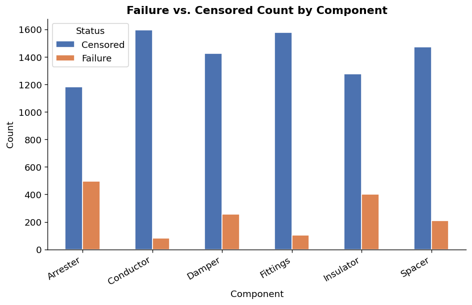
*รูปที่ 1 — การกระจายของสถานะ event/censored ทั้งภาพรวมและรายอุปกรณ์ / Distribution of event vs. censored observations overall and per component.*

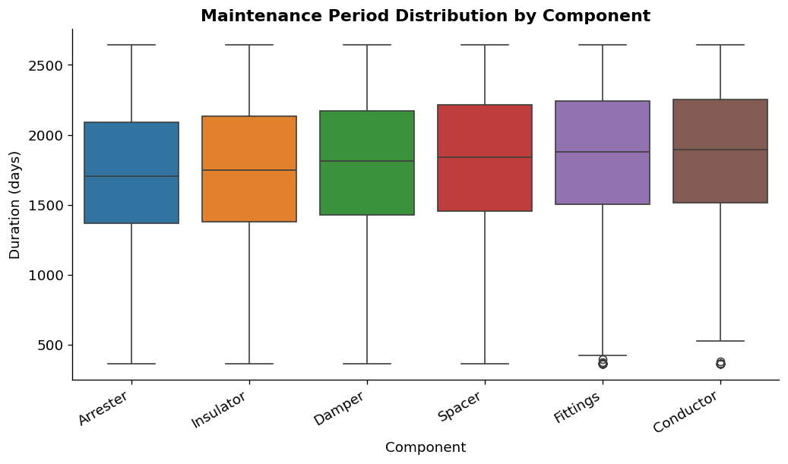
*รูปที่ 2 — Boxplot ของ `maintenance_period_days` แยกตามอุปกรณ์ / Boxplot of duration grouped by component.*

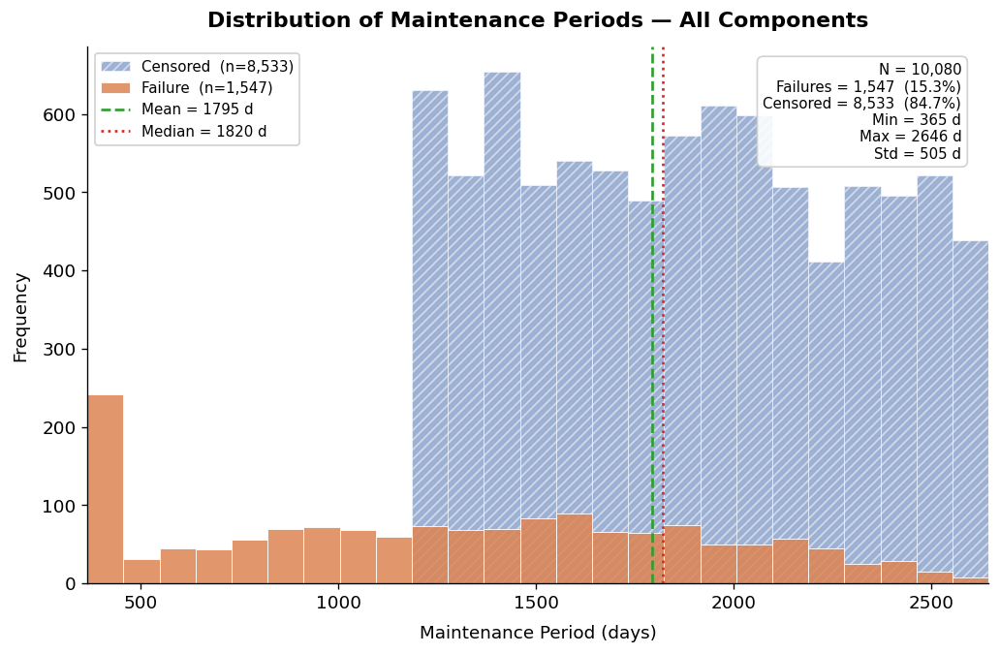
*รูปที่ 3 — ฮิสโทแกรมของ duration ภาพรวม แยกสีระหว่าง censored และ failure / Overall duration histogram (censored vs. failure).*

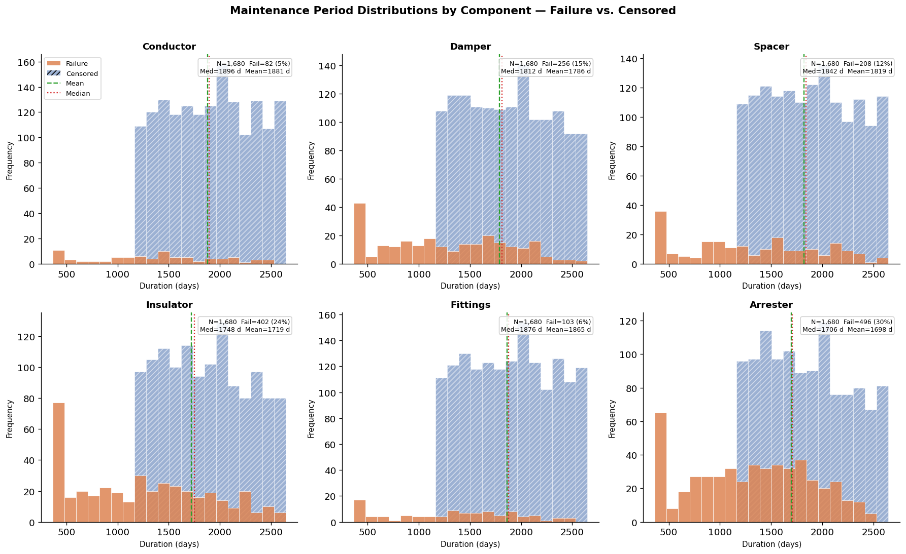
*รูปที่ 4 — ฮิสโทแกรมของ duration แยกตามอุปกรณ์ (กริด 2×3) / Per-component duration histograms (2×3 grid).*

---

## 5. Phase 3 — Non-parametric Survival / การวิเคราะห์การอยู่รอดแบบนอนพาราเมตริก

### 5.1 วัตถุประสงค์และบทบาทของแต่ละแบบจำลอง / Purpose & Role of Each Model
เฟสนี้ประมาณค่าการอยู่รอดโดย **ไม่กำหนดรูปแบบการแจกแจง** ล่วงหน้า (non-parametric) เพื่อให้ข้อมูล "พูดเอง" ก่อนนำไปเทียบกับแบบจำลองพาราเมตริกในเฟสถัดไป ใช้เวลาอยู่รอดจาก `maintenance_period_days` และตัวบ่งชี้เหตุการณ์จาก `event_occurred` แบ่งวิเคราะห์เป็น 3 เครื่องมือ โดยแต่ละตัวตอบคำถามต่างกัน:

- **Kaplan-Meier — KM (Model 1):** ตอบคำถาม *"ความน่าจะเป็นในการอยู่รอด S(t) ตามเวลาเป็นอย่างไร?"* เป็น **product-limit estimator** ที่ประมาณ S(t) จากผลคูณสะสมของสัดส่วนที่รอดผ่านแต่ละช่วงเวลาที่มีเหตุการณ์เกิดขึ้น แนวคิดเชิงสูตรคือ S(t) = Π (1 − d_i / n_i) สำหรับทุกเวลาเหตุการณ์ t_i ≤ t โดย d_i คือจำนวนการชำรุด ณ เวลา t_i และ n_i คือจำนวนหน่วยที่ยังเสี่ยง (at-risk) ช่วงความเชื่อมั่นใช้สูตร Greenwood (Greenwood CI) ทุกหน่วยที่ถูกเซ็นเซอร์จะถูกนำออกจากชุดเสี่ยงอย่างถูกต้องโดยไม่นับเป็นเหตุการณ์

- **Nelson-Aalen — NA (Model 2):** ตอบคำถาม *"อัตราความเสี่ยงสะสม (cumulative hazard) H(t) = Σ d_i / n_i เป็นเท่าใด?"* เป็นการสะสมความเสี่ยง (accumulated risk) ตลอดเวลา ค่าความชัน (slope) ของ H(t) สะท้อนอัตราความเสี่ยงทันที (instantaneous hazard) ส่วนเพิ่ม (increments) ของ NA จะถูกส่งต่อให้ kernel hazard estimator ในเฟส 4 เพื่อประมาณ hazard function แบบเรียบ (smoothed)

- **Log-rank test:** ตอบคำถาม *"เส้นการอยู่รอดของแต่ละกลุ่มแตกต่างกันอย่างมีนัยสำคัญหรือไม่?"* โดยเปรียบเทียบข้ามกลุ่ม component / region / HI class ภายใต้สมมติฐานหลัก H₀ ว่าเส้น survival ของทุกกลุ่มเหมือนกัน ใช้ทั้งแบบ multivariate (รวมทุกกลุ่ม) และ pairwise (ทีละคู่)

### 5.2 ตารางสรุป Kaplan-Meier / KM Survival Table
อ้างอิงจาก `outputs/tables/km_survival_summary.csv` ประเมินที่ AT_RISK_TIMES = [365, 730, 1095, 1460, 1825, 2190] วัน (1–6 ปี)

| Component | S(1yr) | S(2yr) | S(3yr) | S(4yr) | S(5yr) | **S(6yr)** | Median |
|-----------|-------:|-------:|-------:|-------:|-------:|-----------:|:------:|
| Conductor | 0.994 | 0.991 | 0.984 | 0.973 | 0.958 | **0.939** | ∞ |
| Fittings | 0.992 | 0.985 | 0.978 | 0.966 | 0.946 | **0.922** | ∞ |
| Spacer | 0.983 | 0.971 | 0.948 | 0.928 | 0.897 | **0.851** | ∞ |
| Damper | 0.979 | 0.963 | 0.932 | 0.909 | 0.862 | **0.803** | ∞ |
| Insulator | 0.963 | 0.932 | 0.895 | 0.848 | 0.794 | **0.731** | ∞ |
| Arrester | 0.969 | 0.944 | 0.890 | 0.828 | 0.738 | **0.630** | ∞ |

**การตีความ / Interpretation:** ที่ปีที่ 6 (2,190 วัน) Conductor ยังมีโอกาสรอด 93.9% และ Fittings 92.2% ขณะที่ Arrester เหลือเพียง 63.0% และ Insulator 73.1% — ยืนยันลำดับความเสี่ยงเดียวกับเฟส 2 ทุกกลุ่มมี **median survival = ∞** เพราะไม่มีกลุ่มใดที่ S(t) ลดต่ำกว่า 0.50 ภายในกรอบเวลาการศึกษา ซึ่งเป็นผลที่ **คาดหมายได้** ภายใต้อัตราการเซ็นเซอร์สูงถึง 84.7% (กว่าครึ่งของหน่วยยังคงอยู่รอดเมื่อสิ้นสุดการเก็บข้อมูล) ค่า ∞ จึงไม่ใช่ความผิดพลาด แต่บ่งชี้ว่าต้องอาศัยแบบจำลองพาราเมตริก (เฟส 5–7) เพื่อ extrapolate อายุการใช้งานที่แท้จริง

### 5.3 ผลการทดสอบ Log-rank / Log-rank Test Results

**ตาม component (multivariate):** χ² = 643.9, **p < 0.001** — ปฏิเสธ H₀ อย่างชัดเจน เส้น survival ของ component ต่างกันจริง

**Pairwise ตาม component** (`logrank_pairwise_component.csv`): ทุกคู่แตกต่างกันอย่างมีนัยสำคัญ (p < 0.05) **ยกเว้น** คู่ Conductor–Fittings (p = 0.104) ซึ่งแยกกันไม่ออกในเชิงสถิติ — สอดคล้องกับการที่ทั้งสองมีอัตราการชำรุดต่ำสุดและเส้น KM ที่อยู่ติดกัน

**Pairwise ตาม region** (`logrank_pairwise_region.csv`):

| Pair | p-value | นัยสำคัญ |
|------|--------:|:--------:|
| Central – North | 1.3 × 10⁻¹⁰ | แตกต่างมาก |
| Central – South | 4.7 × 10⁻⁹ | แตกต่างมาก |
| Central – Northeast | 6.5 × 10⁻⁸ | แตกต่างมาก |
| North – Northeast | 0.318 | ไม่แตกต่าง |
| North – South | 0.552 | ไม่แตกต่าง |
| Northeast – South | 0.672 | ไม่แตกต่าง |

**การตีความ / Interpretation:** ภูมิภาค **Central แตกต่างจากทุกภูมิภาคอื่นอย่างมีนัยสำคัญสูง** (p < 1 × 10⁻⁷ ทุกคู่) ขณะที่ North, Northeast และ South **แยกกันไม่ออก** ในเชิงสถิติ (p = 0.318–0.672) ชี้ว่ามีปัจจัยเชิงภูมิศาสตร์/สิ่งแวดล้อมเฉพาะของ Central ที่ทำให้พฤติกรรมการอยู่รอดต่างจากภูมิภาคอื่น ซึ่งจะถูกอธิบายเชิงปริมาณผ่าน covariate ในเฟส Cox/AFT

### 5.4 รูปประกอบ / Reference Figures

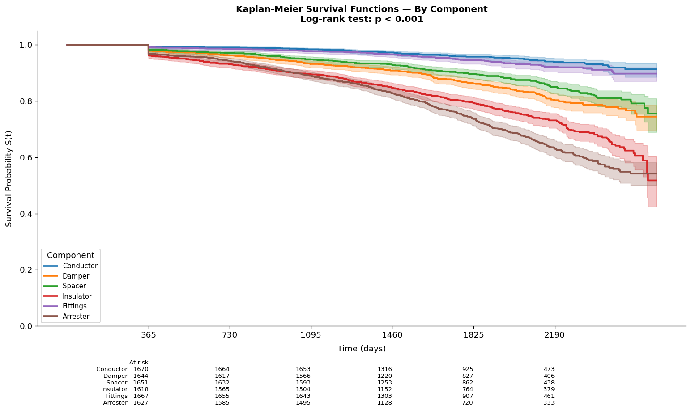
*รูปที่ 5 — เส้นโค้ง KM แยกตามอุปกรณ์ พร้อมแถบ 95% CI และตาราง numbers-at-risk / KM survival curves per component with 95% CI and numbers-at-risk table.*

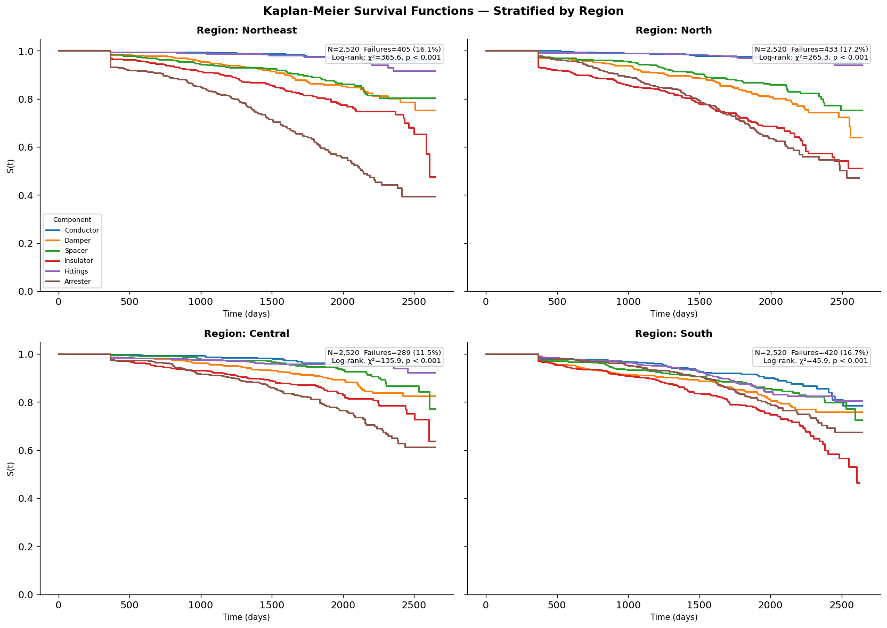
*รูปที่ 6 — เส้นโค้ง KM แยกตามภูมิภาค (กริด 2×2) — Central แยกออกชัดเจนจากภูมิภาคอื่น / KM curves per region (2×2 grid); Central separates clearly from the others.*

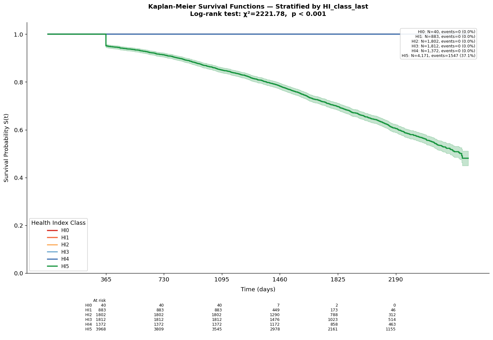
*รูปที่ 7 — เส้นโค้ง KM แยกตามชั้น Health Index (HI0–HI5) แสดงการลดลงของ S(t) เมื่อ HI สูงขึ้น / KM curves by health index class (HI0–HI5).*

### 5.5 เชื่อมโยงสู่เฟสถัดไป / Link to Next Phase
Nelson-Aalen ให้ภาพ **cumulative hazard H(t)** ที่มีรูปทรงเว้า (concave) บ่งชี้ว่าอัตราความเสี่ยงทันที (instantaneous hazard) มีแนวโน้มลดลงตามเวลา รูปทรงของเส้นสะสมความเสี่ยงนี้เป็นแรงจูงใจโดยตรงให้เฟส 4 ประมาณ **instantaneous hazard h(t)** แบบเรียบด้วย Epanechnikov kernel smoother บนส่วนเพิ่ม (increments) ของ NA เพื่อเปิดเผยว่าความเสี่ยงสูงสุดเกิดในช่วงใดของอายุการใช้งาน และเพื่อเปรียบเทียบกับแบบจำลองพาราเมตริก (Weibull, Log-logistic ฯลฯ) ต่อไป

---

## 6. Phase 4 — การประมาณอัตราความเสี่ยง / Hazard Estimation

### 6.1 จุดประสงค์ของเฟสนี้ / Purpose

ใน Phase 3 เราได้ประมาณ **cumulative hazard H(t)** (อัตราความเสี่ยงสะสม) ผ่าน Nelson-Aalen estimator ซึ่งบอก "ความเสี่ยงรวมที่สะสมมาถึงเวลา t" แต่ยังไม่บอก **รูปร่างของความเสี่ยงในแต่ละช่วงเวลา** โดยตรง

เป้าหมายของ Phase 4 คือการก้าวจาก H(t) ไปสู่ **instantaneous hazard rate h(t)** (อัตราความเสี่ยง ณ ขณะหนึ่ง) เพื่อตอบคำถามเชิงรูปร่าง (failure shape) ว่า ความเสี่ยงของการเสียหาย **เพิ่มขึ้น / ลดลง / คงที่** ตามอายุการใช้งานหรือไม่ ซึ่งมีนัยทางวิศวกรรมโดยตรง:

- **h(t) เพิ่มขึ้นตามเวลา** ⇒ พฤติกรรมเสื่อมสภาพ (wear-out) — ยิ่งเก่ายิ่งเสี่ยง สมเหตุสมผลกับการบำรุงรักษาเชิงป้องกัน
- **h(t) คงที่** ⇒ ความเสียหายแบบสุ่ม (random / memoryless) — การเปลี่ยนตามอายุไม่ช่วยลดความเสี่ยง
- **h(t) ลดลงตามเวลา** ⇒ พฤติกรรมเสียช่วงต้น (infant mortality / burn-in)

นอกจากนี้ Phase 4 ยังทำการ fit **parametric distributions** เพื่อให้ h(t) อยู่ในรูป **closed-form formula** ที่สามารถใช้ทำนาย (prediction) และคาดการณ์นอกช่วงข้อมูล (extrapolation) ได้ ซึ่ง non-parametric estimator ทำไม่ได้

ในเฟสนี้มี **6 โมเดล** ได้แก่ kernel hazard estimator (Model 3) และ parametric models อีก 5 ตัว (Models 4–8)

### 6.2 Kernel Hazard / Epanechnikov (Model 3)

Kernel hazard estimator ตามแนวทาง Yang et al. (2022) เป็นวิธี **non-parametric** ที่ปรับ (smooth) ความเสี่ยงจาก increment ของ Nelson-Aalen ให้เป็นเส้นโค้งต่อเนื่อง (ดู `src/hazard_models.py`):

$$\hat{h}(t) = \frac{1}{b} \sum_i K\!\left(\frac{t - t_i}{b}\right) \cdot \Delta H(t_i)$$

โดยที่:
- $t_i$ คือ **Nelson-Aalen event times** (เวลาที่เกิดความเสียหายจริง)
- $\Delta H(t_i)$ คือ **cumulative-hazard increments** — ส่วนต่างของ H(t) ที่แต่ละ event time (จุดนี้คือวิธีที่ผลลัพธ์ Phase 3 ป้อนต่อเข้า Phase 4 โดยตรง) โดยการนับ censored observations ถูกจัดการอย่างถูกต้องภายใน NA estimator แล้ว
- $K(\cdot)$ คือ **Epanechnikov kernel**: $K(u) = 0.75\,(1 - u^2)\cdot\mathbb{1}(|u| \le 1)$ — kernel ที่มี support จำกัด ($|u|\le 1$) และให้น้ำหนักมากที่สุดที่จุดศูนย์กลาง

**การเลือก bandwidth ด้วย LSCV (least-squares cross-validation):**

bandwidth $b$ ควบคุมความเรียบ (smoothness) ของเส้น — ค่ามากเกินไปทำให้เส้นเรียบเกินจริง (oversmooth) ค่าน้อยเกินไปทำให้เส้นกระตุก (undersmooth) วิธีเลือก $b$ ในโค้ดเป็นดังนี้:

1. **Silverman seed**: $b_{\text{sil}} = 1.06\,\sigma\,n^{-1/5}$ (rule-of-thumb เริ่มต้น)
2. สร้าง **candidate grid 25 ค่า** ในช่วง $[0.3, 2.5] \times b_{\text{sil}}$
3. ใช้ **leave-one-out (LOO)** ผ่าน kernel weight matrix ที่ zeroed diagonal (no Python loop — fully vectorised) เพื่อหาค่า $\hat{h}_{-i}(t_i)$
4. minimise objective:
   $$\text{CV}(b) = \int \hat{h}^2(t)\,dt \;-\; 2\sum_i \hat{h}_{-i}(t_i)\,\Delta H(t_i)$$
   โดยใช้ **trapezoidal integration** บน grid 200 จุด (`np.trapz`) สำหรับเทอม $\int \hat{h}^2 dt$
5. เลือก $b^*$ ที่ทำให้ CV(b) ต่ำสุด

หมายเหตุ: มีการ **trim ปลายหาง 2%** (`trim_pct=2.0`) ในขั้นตอนการประเมิน h(t) เพื่อลด boundary bias ที่ขอบของช่วงข้อมูล และมี fallback ไปใช้ Silverman bandwidth กรณี event น้อยกว่า 5 ตัว

**Per-component bandwidths** (จาก LSCV; bandwidth แปรผกผันกับจำนวน event — ยิ่ง event มาก ข้อมูลยิ่งแน่น ใช้ bandwidth แคบได้):

| Component / ส่วนประกอบ | Events | Bandwidth b* (วัน) |
|---|---|---|
| Conductor | 72 | 539 |
| Damper | 183 | 188 |
| Spacer | 152 | 144 |
| Insulator | 308 | 77 |
| Fittings | 77 | 591 |
| Arrester | 391 | 418 |

จะเห็นว่า Insulator (308 events) และ Arrester (391 events) ซึ่งมี event มากที่สุด ได้ bandwidth แคบที่สุดและกว้างปานกลางตามลำดับ ส่วน Fittings และ Conductor ที่มี event น้อย ได้ bandwidth กว้างที่สุด (591 และ 539 วัน) เพื่อชดเชยความเบาบางของข้อมูล

**ผลลัพธ์ / Result:** ทุกส่วนประกอบแสดงรูปร่าง hazard ที่ **เพิ่มขึ้นแบบ monotonic แล้ว plateau** (monotonically increasing then plateauing) ⇒ ยืนยันพฤติกรรม **wear-out** ไม่ใช่ความเสียหายแบบ random/constant ซึ่งเป็นหลักฐานเชิงประจักษ์ตัวแรกที่จะถูกยืนยันซ้ำด้วย parametric models ใน Phase 5

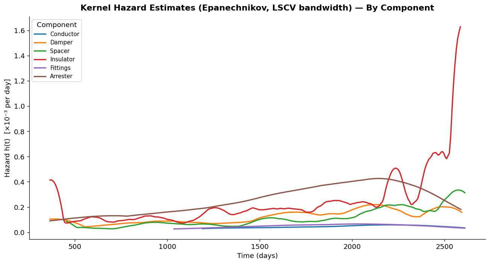
*รูปที่ 8 — เส้น kernel hazard (Epanechnikov) ซ้อนทับทุกอุปกรณ์ ทุกเส้นเพิ่มขึ้นแบบ monotonic ⇒ wear-out / Epanechnikov kernel hazard overlay for all components; all curves rise monotonically (wear-out).*

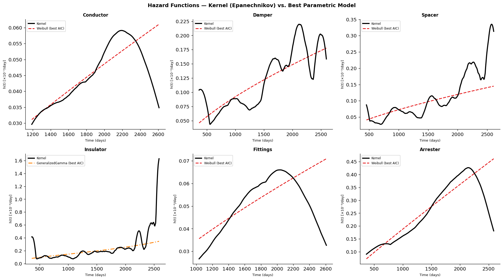
*รูปที่ 9 — ภาพรวมรายอุปกรณ์ (กริด 2×3): kernel hazard เทียบกับ parametric ที่เหมาะสมที่สุด / Per-component overview (2×3): kernel vs. best-fit parametric hazard.*

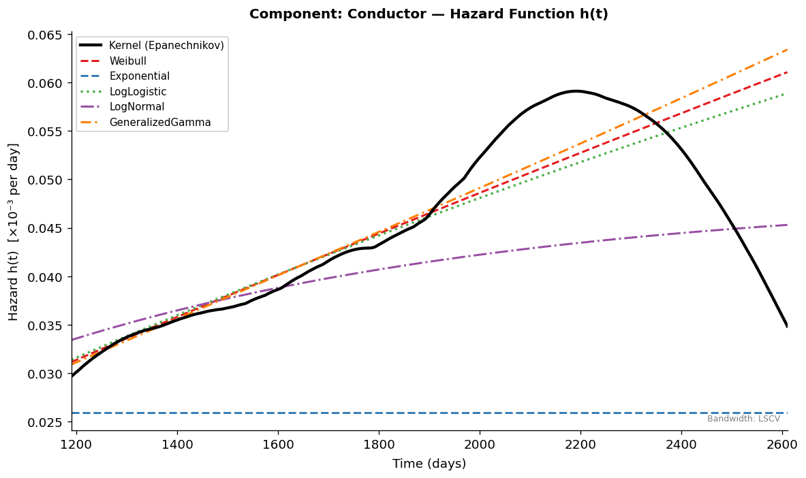
*รูปที่ 10 — Conductor: kernel hazard + 5 parametric hazards / Conductor: kernel + 5 parametric hazard curves.*

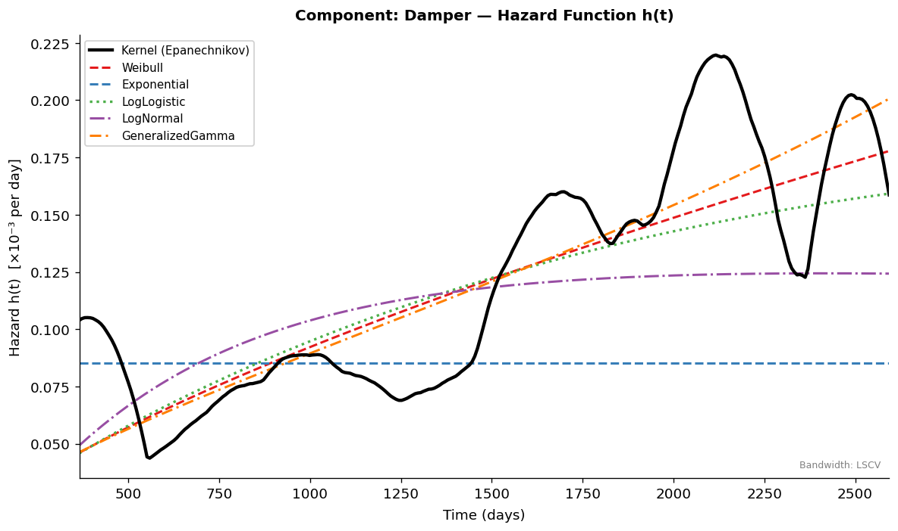
*รูปที่ 11 — Damper: kernel hazard + 5 parametric hazards / Damper: kernel + 5 parametric hazard curves.*

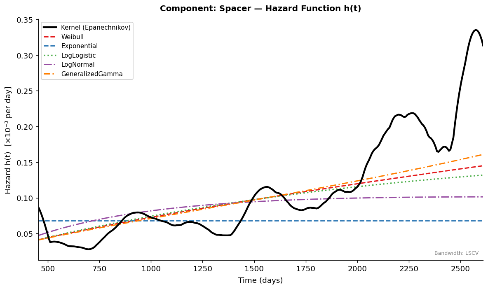
*รูปที่ 12 — Spacer: kernel hazard + 5 parametric hazards / Spacer: kernel + 5 parametric hazard curves.*

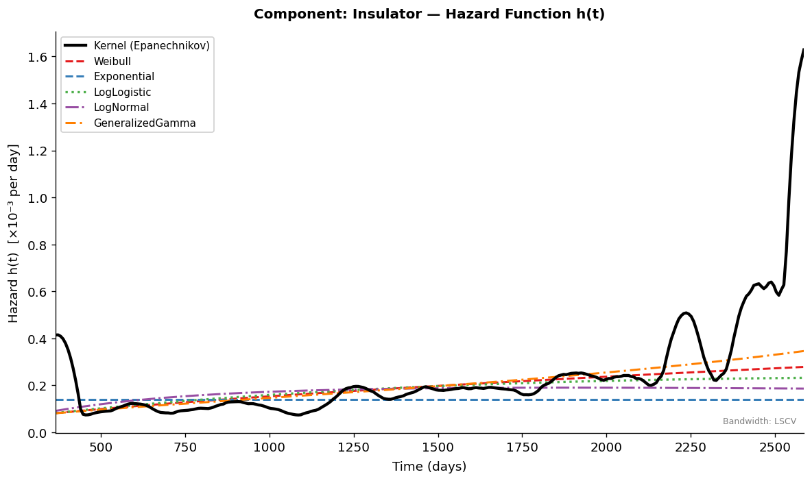
*รูปที่ 13 — Insulator: kernel hazard + 5 parametric hazards (best fit = Generalized-gamma) / Insulator: kernel + 5 parametric hazard curves.*

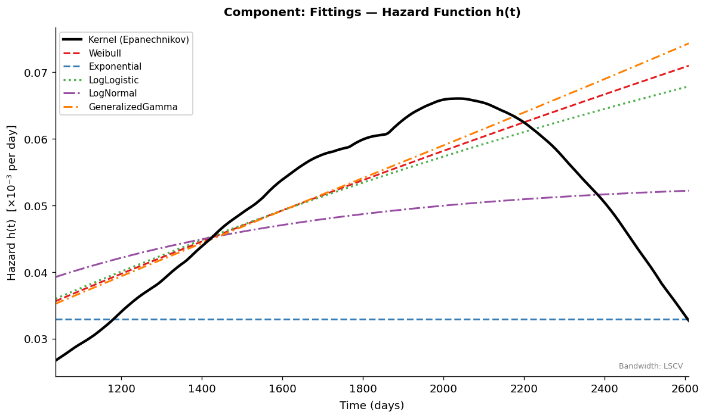
*รูปที่ 14 — Fittings: kernel hazard + 5 parametric hazards / Fittings: kernel + 5 parametric hazard curves.*

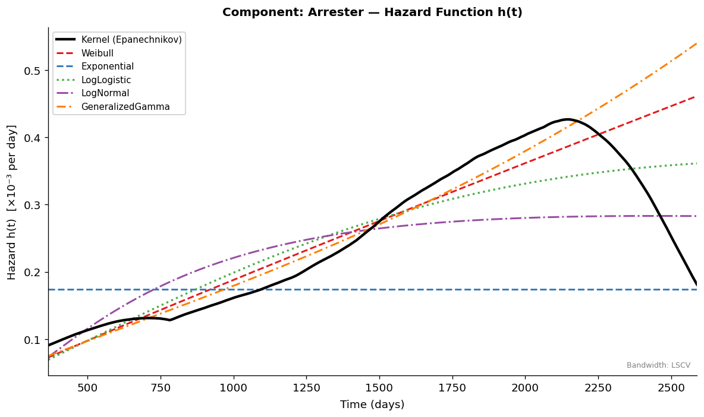
*รูปที่ 15 — Arrester: kernel hazard + 5 parametric hazards (shape ρ สูงสุด) / Arrester: kernel + 5 parametric hazard curves (highest shape ρ).*

### 6.3 Parametric Models (Models 4–8)

หลังจากเห็นรูปร่าง hazard เชิงประจักษ์จาก kernel แล้ว เรา fit **parametric distributions 5 ตัว** ผ่าน **maximum likelihood estimation (MLE)** ด้วย lifelines โดยอ่านค่า hazard ออกมาด้วยเมธอด `hazard_at_times()` (ดู `parametric_hazard()` ใน `src/hazard_models.py`)

**ทำไมต้อง fit parametric ทับ kernel?** — เพราะ parametric model ให้:
- **smooth** — เส้นเรียบ ไม่ขึ้นกับ bandwidth
- **extrapolatable** — คาดการณ์นอกช่วงข้อมูล (เกินอายุที่สังเกตได้) ผ่านสูตร closed-form
- **parameter-interpretable** — พารามิเตอร์ (เช่น shape $\rho$) ตีความเชิงฟิสิกส์ได้โดยตรง
- **AIC-comparable** — เปรียบเทียบ goodness-of-fit เชิงปริมาณข้ามโมเดลได้ (นำไปใช้ใน Phase 5)

| # | Model / แบบจำลอง | Parameters | รูปร่าง hazard ที่แทนได้ / Hazard shape | lifelines Fitter |
|---|---|---|---|---|
| 4 | **Weibull** | scale $\lambda$, shape $\rho$ | monotonic — เพิ่ม ($\rho>1$), คงที่ ($\rho=1$), ลด ($\rho<1$) | `WeibullFitter` |
| 5 | **Exponential** | rate $\lambda$ | **คงที่เท่านั้น** (constant) — memoryless | `ExponentialFitter` |
| 6 | **Log-logistic** | scale $\alpha$, shape $\beta$ | unimodal — เพิ่มแล้วลด (hump) หรือ ลดอย่างเดียว | `LogLogisticFitter` |
| 7 | **Log-normal** | $\mu$, $\sigma$ | unimodal — เพิ่มแล้วลด | `LogNormalFitter` |
| 8 | **Generalized-gamma** | $\mu$, $\ln\sigma$, $\lambda$ | ยืดหยุ่นสูง — ครอบคลุม Weibull, log-normal, gamma เป็น special cases | `GeneralizedGammaFitter` |

Exponential เป็นกรณีพิเศษของ Weibull ที่ $\rho=1$ จึงเป็น "ตัวควบคุม" สำหรับทดสอบสมมติฐาน constant-hazard ส่วน Generalized-gamma เป็นโมเดลที่ยืดหยุ่นที่สุด (3 พารามิเตอร์) ครอบคลุมหลายตระกูลเป็นกรณีย่อย

---

## 7. Phase 5 — การคัดเลือกแบบจำลอง / Model Selection

### 7.1 จุดประสงค์และวิธีการ / Purpose & Method

เมื่อ fit ครบ 5 parametric models ต่อส่วนประกอบแล้ว เราต้องเลือกโมเดลที่ **อธิบายข้อมูลได้ดีที่สุดโดยไม่ overfit** เกณฑ์ที่ใช้คือ **Akaike Information Criterion (AIC)** ซึ่ง trade-off ระหว่าง goodness-of-fit กับความซับซ้อนของโมเดล:

$$\text{AIC} = 2k + 2\cdot(-\text{LLV})$$

โดย $k$ = จำนวนพารามิเตอร์ และ LLV = Log-Likelihood Value (ค่า log-likelihood ของโมเดลที่ fit แล้ว) — AIC ต่ำกว่า = ดีกว่า

จากนั้นคำนวณ **ΔAIC** เทียบกับโมเดลที่ดีที่สุดของแต่ละส่วนประกอบ:

$$\Delta\text{AIC} = \text{AIC} - \min(\text{AIC})$$

**เกณฑ์การตัดสิน (Burnham & Anderson):**
- **ΔAIC < 2** — มี substantial support (โมเดลแข่งขันได้ ใกล้เคียงตัวที่ดีที่สุด)
- **ΔAIC 4–7** — considerably less support (ด้อยกว่าอย่างเห็นได้ชัด)
- **ΔAIC > 10** — essentially no support (ปฏิเสธได้)

### 7.2 ตาราง ΔAIC เต็ม / Full ΔAIC Matrix

(ตรวจสอบจาก `outputs/tables/delta_aic_matrix.csv`)

| Component / ส่วนประกอบ | Weibull | Exponential | LogLogistic | LogNormal | GenGamma | **Best** |
|---|---|---|---|---|---|---|
| Conductor | **0.00** | 26.71 | 0.17 | 1.79 | 1.85 | **Weibull** |
| Damper | **0.00** | 64.99 | 0.87 | 0.69 | 1.61 | **Weibull** |
| Spacer | **0.00** | 55.68 | 1.51 | 4.08 | 0.66 | **Weibull** |
| Insulator | 1.87 | 93.82 | 6.82 | 5.02 | **0.00** | **GenGamma** |
| Fittings | **0.00** | 27.71 | 0.27 | 2.03 | 1.77 | **Weibull** |
| Arrester | **0.00** | 206.25 | 5.98 | 17.81 | 1.18 | **Weibull** |

### 7.3 การตีความ / Interpretation

**1. Weibull ชนะ 5 ใน 6 ส่วนประกอบ** (Conductor, Damper, Spacer, Fittings, Arrester) สำหรับ **Insulator** แม้ Generalized-gamma จะดีที่สุด แต่ Weibull มี ΔAIC = 1.87 < 2 ซึ่งยังอยู่ในเกณฑ์ **substantial support** ดังนั้นเลือก **Weibull เป็น unified model** เดียวสำหรับทุกส่วนประกอบได้อย่างมีเหตุผล — ลดความซับซ้อนของการตีความและการนำไปใช้ในเฟสถัดไป (Cox PH ใช้ baseline ร่วม, AFT ใช้ Weibull โดยตรง)

**2. Exponential ถูกปฏิเสธในทุกส่วนประกอบ** (ΔAIC อยู่ในช่วง 26.71–206.25 ≫ 10) — แสดงว่าสมมติฐาน **constant hazard เป็นเท็จ** ผลนี้ยืนยันซ้ำ (cross-validate) พฤติกรรม wear-out ที่ kernel estimator ใน Phase 4 ตรวจพบ โดยเฉพาะ Arrester ที่ ΔAIC ของ Exponential สูงถึง 206.25 — ปฏิเสธ constant-hazard อย่างเด็ดขาดที่สุด สอดคล้องกับการเป็นส่วนประกอบที่มี event มากที่สุดและเสื่อมเร็วที่สุด

**3. โมเดล unimodal (LogLogistic, LogNormal)** แข่งขันได้ในบางส่วนประกอบ (เช่น LogLogistic ΔAIC 0.17–1.51 ใน Conductor/Damper/Spacer/Fittings) แต่ไม่มีตัวใดเอาชนะ Weibull ได้ ยืนยันว่า hazard เป็นแบบ monotonic-increasing ไม่ใช่ hump-shaped

### 7.4 พารามิเตอร์ Weibull ที่ fit ได้ / Fitted Weibull Parameters

(ตรวจสอบจาก `outputs/tables/fitted_parameters.csv`)

| Component / ส่วนประกอบ | scale $\lambda$ (วัน) | shape $\rho$ | การตีความ shape |
|---|---|---|---|
| Conductor | 9793.6 | 1.857 | $\rho>1$ ⇒ increasing hazard |
| Damper | 5593.5 | 1.689 | $\rho>1$ ⇒ increasing hazard |
| Spacer | 6294.9 | 1.720 | $\rho>1$ ⇒ increasing hazard |
| Fittings | 9431.8 | 1.747 | $\rho>1$ ⇒ increasing hazard |
| Arrester | 3325.9 | 1.944 | $\rho>1$ ⇒ increasing hazard (สูงสุด) |
| Insulator* | — | — | GenGamma: $\mu$=8.416, $\ln\sigma$=−1.775, $\lambda$=3.891 |

\* Insulator best-fit เป็น Generalized-gamma (Weibull เป็นทางเลือกที่ ΔAIC=1.87)

**การตีความพารามิเตอร์:**

- **ทุกค่า $\rho > 1$** (1.689–1.944) ⇒ **increasing hazard (wear-out)** ทุกส่วนประกอบ — ยืนยันข้อสรุปจาก Phase 4 ในเชิงพารามิเตอร์อย่างชัดเจน ไม่มีส่วนประกอบใดแสดง random failure ($\rho=1$) หรือ infant mortality ($\rho<1$)
- **Arrester มี $\rho$ สูงสุด (1.944)** ⇒ hazard ไต่ขึ้นชันที่สุด สอดคล้องกับการเป็นส่วนประกอบเสี่ยงสูงสุด
- **scale $\lambda$ แปรผกผันกับลำดับความเสี่ยง (risk ranking)** — $\lambda$ คือ characteristic life (มาตราเวลาของการเสียหาย): Arrester $\lambda$=3325.9 (ต่ำสุด ⇒ เสียเร็วสุด/เสี่ยงสุด) ในขณะที่ Conductor $\lambda$=9793.6 และ Fittings $\lambda$=9431.8 (สูงสุด ⇒ ทนทานสุด/เสี่ยงต่ำสุด) ลำดับนี้สอดคล้องกับอัตราการเกิด event ที่สังเกตได้ใน Phase 2 อย่างสมบูรณ์

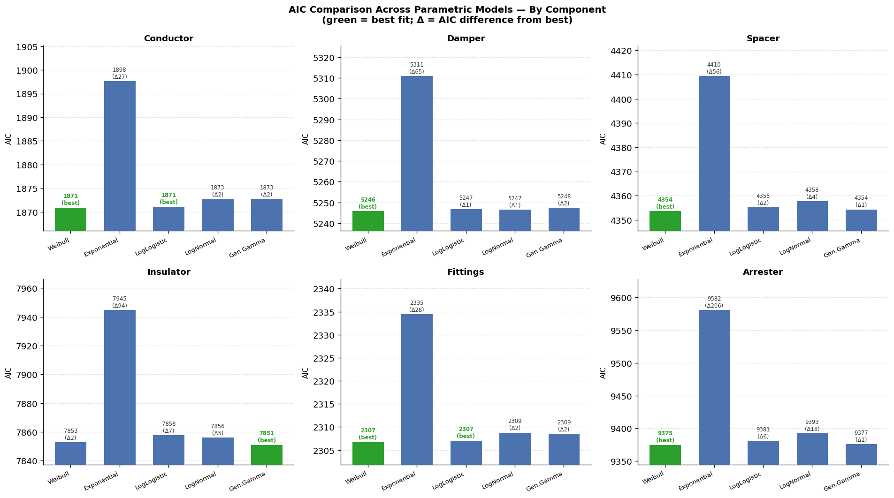
*รูปที่ 16 — แผนภูมิแท่ง AIC แยกตามอุปกรณ์ (faceted) สำหรับทั้ง 5 distribution / Faceted AIC bar chart per component across the 5 distributions.*

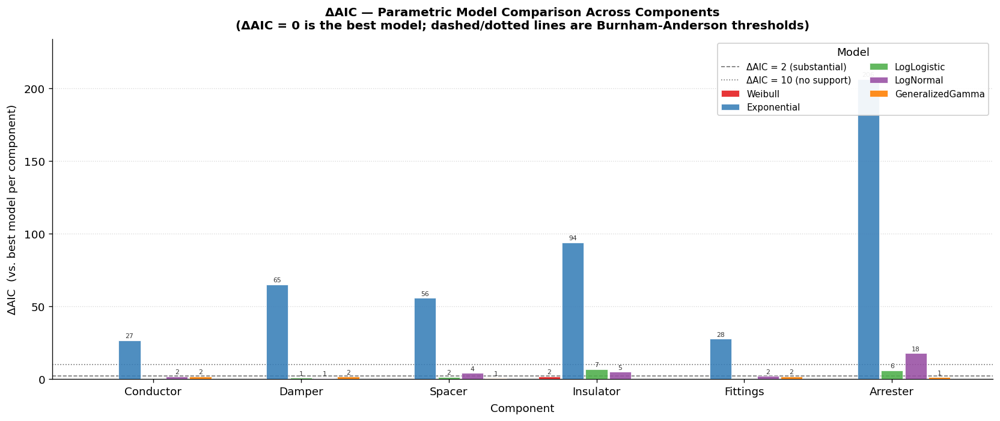
*รูปที่ 17 — ΔAIC grouped bar พร้อมเส้นเกณฑ์ Burnham & Anderson (ΔAIC = 2, 4, 10) / Grouped ΔAIC bars with B&A support thresholds.*

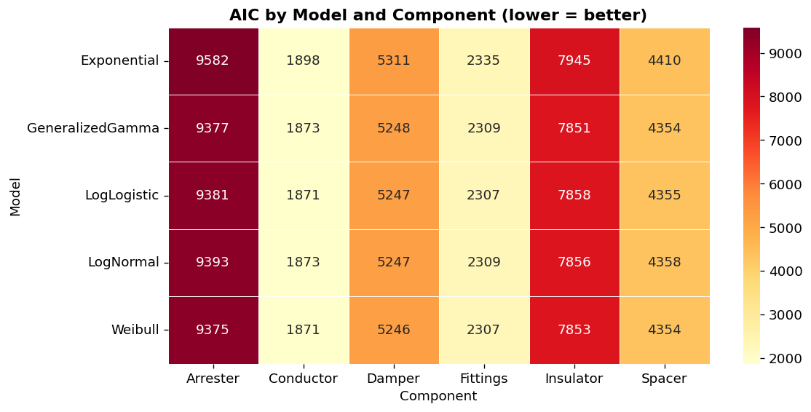
*รูปที่ 18 — Heatmap ของ AIC (distribution × อุปกรณ์) ค่าต่ำ (เข้ม) = ดีกว่า / AIC heatmap (model × component); lower (darker) is better.*

### 7.5 เชื่อมโยงสู่เฟสถัดไป / Link to Next Phase

Phase 3–5 ทั้งหมดวิเคราะห์ **เวลาเพียงอย่างเดียว (time alone)** โดยยังไม่นำ covariates (ปัจจัยสภาพแวดล้อม/สุขภาพ/การบุกรุก) เข้ามาในแบบจำลองเลย ผลที่ได้บอกเราชัดเจน 2 ประการ:

1. **รูปร่างของความเสี่ยงคือ wear-out** (kernel + Weibull $\rho>1$ ยืนยันตรงกัน) — การบำรุงรักษาเชิงป้องกันตามอายุมีเหตุผลรองรับ
2. แต่ละส่วนประกอบมี **characteristic life ($\lambda$) ต่างกันชัดเจน** — บางตัวเสี่ยงสูงกว่าตัวอื่นมาก

อย่างไรก็ตาม คำถามสำคัญที่ time-only models **ตอบไม่ได้** คือ: **ปัจจัยใดเป็นตัวขับเคลื่อนความเสี่ยง?** (ฟ้าผ่า ความชื้น PM2.5 health index การบุกรุก ฯลฯ มีผลเชิงปริมาณเท่าไร?) การจะตอบคำถามนี้ — และเพื่อนำไปสู่การทำนาย RUL รายหน่วยและจัดลำดับความสำคัญในการบำรุงรักษา — ต้องใช้ **regression survival models** ที่รวม covariates ได้แก่ **Cox Proportional Hazards (Phase 6)** และ **Weibull Accelerated Failure Time / AFT (Phase 7)** ซึ่งจะนำเสนอในส่วนถัดไป โดย Weibull baseline ที่คัดเลือกได้ใน Phase 5 จะถูกใช้เป็นรากฐานของโมเดล AFT โดยตรง

---

## 8. Phase 6 — แบบจำลอง Cox Proportional Hazards / Cox Proportional Hazards Model

### 8.1 จุดหมุนของงานวิจัย / The Pivot of the Study

Phase 6 คือ **จุดหมุน (pivot)** ของทั้งงานวิจัยนี้ ใน Phase 3–5 เราวิเคราะห์ **เวลาเพียงอย่างเดียว (time alone)** — เส้นโค้งการรอด (survival) และอัตราอันตราย (hazard) ถูกมองเป็นฟังก์ชันของเวลาโดยไม่มีตัวแปรร่วม (covariate) เข้ามาเกี่ยวข้อง เราตอบได้แค่ว่า *"ประชากรของอุปกรณ์เสื่อมสภาพไปตามเวลาอย่างไร?"*

Cox PH เปลี่ยนคำถามนั้นโดยใส่ตัวแปรร่วม **เข้าไปในฟังก์ชัน hazard โดยตรง**:

$$h(t \mid \mathbf{x}) = h_0(t)\cdot \exp(\beta_1 x_1 + \beta_2 x_2 + \dots + \beta_p x_p)$$

โดยที่ $h_0(t)$ คือ **baseline hazard** ที่ไม่ได้ถูกกำหนดรูปแบบไว้ล่วงหน้า (unspecified) — นี่คือเหตุผลที่เรียก Cox ว่าแบบจำลอง **กึ่งพารามิเตอร์ (semi-parametric)**: ส่วนของเวลา $h_0(t)$ ปล่อยให้เป็นอิสระ ส่วนของผลกระทบจากตัวแปรร่วม $\exp(\beta \mathbf{x})$ มีรูปแบบพารามิเตอร์ชัดเจน คำถามจึงเลื่อนจาก *"ประชากรเสื่อมไปตามเวลาอย่างไร?"* มาเป็น **"ปัจจัยใดเป็นตัวขับเคลื่อนความเสี่ยงการล้มเหลว และมากน้อยเพียงใด? / WHICH FACTORS drive failure risk, and BY HOW MUCH?"**

**สมมติฐาน Proportional Hazards (PH assumption):** หัวใจของแบบจำลองคือ ผลของตัวแปรร่วมแต่ละตัวจะ **คูณ (multiply)** baseline hazard ด้วยค่าคงที่ $\exp(\beta x)$ ที่ **ไม่เปลี่ยนแปลงตามเวลา (constant over time)** กล่าวคือ อัตราส่วนอันตรายระหว่างสองหน่วยที่มีค่าตัวแปรร่วมต่างกันจะคงที่ตลอดช่วงเวลาที่ศึกษา (สมมติฐานนี้ตรวจสอบใน §8.6)

**การประมาณค่าด้วย Partial Likelihood:** เนื่องจาก $h_0(t)$ ไม่ถูกระบุ Cox จึงประมาณค่าสัมประสิทธิ์ $\beta$ ด้วย **partial likelihood** ซึ่งพิจารณาเฉพาะ *ลำดับการเกิดเหตุการณ์ (order of events)* ในแต่ละชุดเสี่ยง (risk set) ณ เวลาที่เกิดความล้มเหลว โดยไม่ต้องอาศัยรูปแบบของ baseline hazard เลย — ทำให้ Cox ยืดหยุ่นและทนทานต่อรูปร่างของ hazard ที่ไม่ทราบ

---

### 8.2 การเตรียมข้อมูล / Data Preparation
*(ดู `src/cox_model.py` — `prepare_cox_data`, `fit_cox_by_component`)*

แบบจำลองใช้ **ตัวแปรร่วม 7 ตัว (7 covariates)** ดังนี้:

| Covariate | คำอธิบาย / Description | การเข้ารหัส / Encoding |
|---|---|---|
| `lightning_flash_density` | ความหนาแน่นฟ้าผ่า | continuous, z-score |
| `avg_wind_speed_ms` | ความเร็วลมเฉลี่ย (m/s) | continuous, z-score |
| `avg_humidity_pct` | ความชื้นเฉลี่ย (%) | continuous, z-score |
| `pm25_annual_avg` | ค่าฝุ่น PM2.5 เฉลี่ยรายปี | continuous, z-score |
| `HI_score_last` | Health Index Score (0–5) | continuous, z-score |
| `voltage_kv` | แรงดันไฟฟ้า (kV) | continuous, z-score |
| `encroachment_severity` | ระดับการรุกล้ำ | **ordinal** none/minor/moderate/severe → 0/1/2/3 |

**Z-score standardisation:** ตัวแปรต่อเนื่องทั้ง 6 ตัวถูกแปลงเป็นคะแนนมาตรฐาน $(x-\mu)/\sigma$ โดยใช้ **ค่าสถิติจากชุดข้อมูลทั้งหมด (full-dataset $\mu, \sigma$)** ไม่ใช่จากชุดย่อยรายอุปกรณ์ ทำให้ค่า **Hazard Ratio (HR) มีหน่วยเป็น "ต่อ 1 ส่วนเบี่ยงเบนมาตรฐาน (per 1 SD)"** และ **เทียบกันได้ข้ามอุปกรณ์ทุกประเภท (globally comparable)** ส่วน `encroachment_severity` เข้ารหัสแบบ ordinal เพื่อรักษาลำดับความรุนแรง

**กลยุทธ์การ fit:** fit แบบจำลอง Cox **หนึ่งตัวต่อหนึ่งอุปกรณ์ (one model PER component)** รวม 6 แบบจำลอง โดยใช้ `CoxPHFitter(penalizer=0.1)` ซึ่งเป็น **L2 ridge regularisation** เพื่อความเสถียรเชิงตัวเลข (numerical stability) เนื่องจาก events-per-variable (EPV) ค่อนข้างต่ำ อยู่ในช่วง **11.7–70.9** (Conductor มี 82 เหตุการณ์ / 7 ตัวแปร ≈ 11.7 EPV ซึ่งต่ำที่สุด) แถวที่มีค่าว่าง (NA) ถูกตัดทิ้งด้วย `dropna`

---

### 8.3 ตรรกะของแบบจำลองและการตีความ Hazard Ratio / Model Logic & HR Interpretation

จากสัมประสิทธิ์ $\beta$ ที่ประมาณได้ เราคำนวณ **Hazard Ratio**:

$$\text{HR} = \exp(\text{coef}), \qquad \text{CI}_{95\%} = \exp(\text{coef} \pm 1.96\cdot se)$$

การตีความ (ต่อการเพิ่มขึ้น 1 SD ของตัวแปรร่วม):

- **HR > 1** → เพิ่มอัตราอันตราย เป็น **ปัจจัยเสี่ยง (risk factor)** ทำให้รอดสั้นลง
- **HR < 1** → ลดอัตราอันตราย เป็น **ปัจจัยป้องกัน (protective)**
- **HR = 1** → ไม่มีผล

ระดับนัยสำคัญแสดงด้วยดาว: `***` p<0.001, `**` p<0.01, `*` p<0.05, `ns` ไม่มีนัยสำคัญ

---

### 8.4 ความสามารถในการจำแนก — Concordance Index / Discrimination (C-index)
*(ตรวจสอบจาก `outputs/tables/cox_concordance.csv`)*

C-index วัดความสามารถของแบบจำลองในการ **จัดอันดับ (rank)** ว่าหน่วยใดจะล้มเหลวก่อน: 0.5 = สุ่ม (random), 0.7 = ดี (good), > 0.8 = ดีเยี่ยม (excellent)

| Component | C-index | การตีความ / Interpretation |
|---|---|---|
| Conductor | **0.910** | ดีเยี่ยม / Excellent |
| Fittings  | **0.885** | ดีเยี่ยม / Excellent |
| Spacer    | 0.795 | ดี / Good |
| Damper    | 0.751 | ดี / Good |
| Insulator | 0.735 | ดี / Good |
| Arrester  | 0.694 | พอใช้ / Acceptable |

**ข้อสังเกตสำคัญ:** การจำแนกดีที่สุดในอุปกรณ์ที่ **ล้มเหลวน้อยและสะอาดที่สุด (rarest/cleanest failures)** คือ Conductor (อัตราล้มเหลว 4.9%) และ Fittings (6.1%) — เมื่อความล้มเหลวถูกขับเคลื่อนโดยตัวแปร HI อย่างชัดเจน แบบจำลองจึงแยกแยะได้คม ในทางกลับกัน Arrester (อัตราล้มเหลว 29.5%) มีความสามารถจำแนกอ่อนที่สุด (0.694) เพราะความล้มเหลวเกิดบ่อยและกระจายตัว สะท้อนความผันผวนจากปัจจัยภายนอก (เช่น ฟ้าผ่า) ที่ทำนายได้ยากกว่า

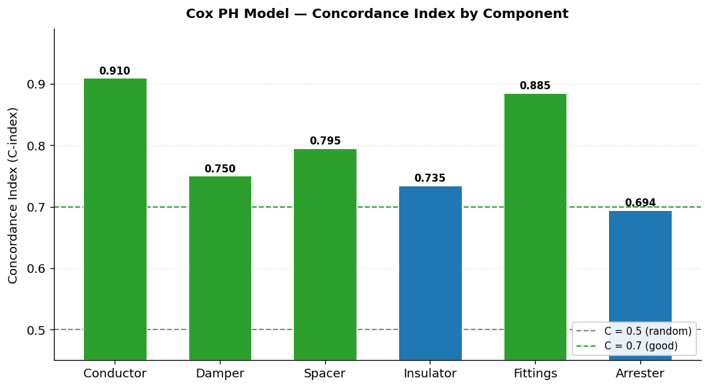
*รูปที่ 19 — ดัชนีความสอดคล้อง (C-index) ของแบบจำลอง Cox PH แยกตามอุปกรณ์ / Concordance index of the Cox PH model per component.*

---

### 8.5 ผลลัพธ์ Hazard Ratio / Hazard Ratio Results
*(ตรวจสอบจาก `outputs/tables/cox_hr_detailed.csv`, `cox_hazard_ratios.csv`)*

**ผลลัพธ์หลัก / KEY FINDINGS:**

**`HI_score_last` มีนัยสำคัญในทุกอุปกรณ์ทั้ง 6 ประเภท (significant in ALL 6 components)** ด้วย HR อยู่ในช่วง **1.65–2.22** และ p < 1e-13 ทั้งหมด — นี่คือ **ตัวทำนายที่ทรงพลังที่สุด (dominant predictor)** ของทั้งแบบจำลอง การที่ Health Index แย่ลง 1 SD เพิ่มความเสี่ยงล้มเหลวขึ้น 65–122%

ตารางต่อไปนี้แสดงเฉพาะ **HR ที่มีนัยสำคัญ (p < 0.05)** ทั้งหมด 9 ค่า:

| Component | Covariate | HR | 95% CI | p | sig |
|---|---|---|---|---|---|
| Conductor | Health Index Score | **1.646** | 1.449–1.870 | 1.9e-14 | *** |
| Damper    | Health Index Score | **1.914** | 1.655–2.215 | 2.6e-18 | *** |
| Spacer    | Health Index Score | **1.836** | 1.613–2.089 | 2.9e-20 | *** |
| Insulator | Health Index Score | **2.073** | 1.772–2.425 | 8.2e-20 | *** |
| Fittings  | Health Index Score | **1.665** | 1.467–1.889 | 2.7e-15 | *** |
| Arrester  | Health Index Score | **2.218** | 1.856–2.650 | 1.7e-18 | *** |
| Insulator | PM2.5 Annual Avg   | **1.284** | 1.173–1.405 | 6.5e-08 | *** |
| Insulator | Avg Humidity (%)   | **1.187** | 1.082–1.303 | 2.9e-04 | *** |
| Arrester  | Lightning Flash Density | **1.221** | 1.120–1.331 | 5.3e-06 | *** |

**การตีความเชิงกายภาพ (physical interpretation) ของผลรอง:**
- **Insulator** ไวต่อสภาพแวดล้อมมลพิษ — ทั้ง **PM2.5** (HR=1.284) และ **ความชื้น (humidity)** (HR=1.187) เร่งความล้มเหลว สอดคล้องกับกลไก *pollution flashover* ที่ฝุ่นเกาะผิวฉนวนแล้วความชื้นทำให้เกิดการนำไฟฟ้าตามผิว
- **Arrester** ไวต่อ **ความหนาแน่นฟ้าผ่า (lightning flash density)** (HR=1.221) ตามหน้าที่หลักของกับดักเสิร์จที่ต้องรับพลังงานฟ้าผ่าซ้ำ ๆ จนเสื่อม

**ตัวแปรร่วมอื่นทั้งหมดไม่มีนัยสำคัญ (ns):** avg_wind_speed, voltage_kv และ encroachment_severity ไม่มีผลที่มีนัยสำคัญในอุปกรณ์ใดเลย

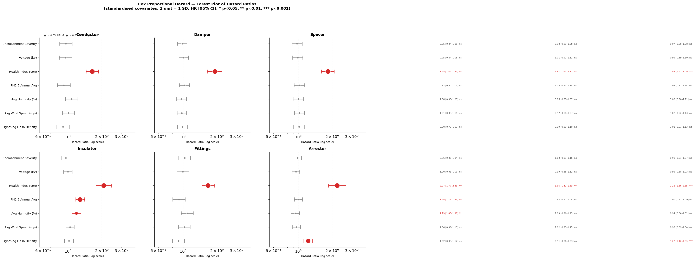
*รูปที่ 20 — Forest plot ของ Hazard Ratio พร้อมช่วงความเชื่อมั่น 95% แยกตามอุปกรณ์ (กริด 2×3) เส้นแนวตั้งที่ HR=1 คือเส้นไม่มีผล / Forest plot of hazard ratios with 95% CI per component (2×3 grid); vertical line at HR=1 marks the no-effect reference.*

---

### 8.6 การตรวจสอบสมมติฐาน PH / PH Assumption Diagnostics
*(ตรวจสอบจาก `outputs/tables/ph_assumption_test.csv` — `check_ph_assumption`)*

เนื่องจาก Cox ตั้งอยู่บนสมมติฐาน proportional hazards เราตรวจสอบด้วย **Schoenfeld residuals test** (`proportional_hazard_test` ด้วยการแปลงเวลาแบบ **rank-transformed time**) ครอบคลุมทั้ง **42 ชุดค่า (6 อุปกรณ์ × 7 ตัวแปรร่วม)** หลักการ: Schoenfeld residuals นิยามเฉพาะ ณ เวลาที่เกิดความล้มเหลว และภายใต้สมมติฐาน PH ควรไม่มีแนวโน้มตามเวลา (no time trend); p < 0.05 ชี้ว่าผลของตัวแปรนั้นอาจเปลี่ยนตามเวลา (ละเมิด PH)

**คำตัดสิน / VERDICT: สมมติฐาน PH เป็นจริง (PH HOLDS).** จากทั้ง 42 ชุดค่า มีเพียง **1 ชุดที่ใกล้เส้นนัยสำคัญ** คือ **Insulator / PM2.5 (p = 0.0457)** ซึ่ง **หายไปทันทีภายใต้การแก้ไข Bonferroni** (เกณฑ์ = 0.05/42 ≈ 0.0012) ส่วนที่เหลือทั้งหมด p > 0.14

สิ่งสำคัญที่สุด: **`HI_score_last` ซึ่งเป็นตัวทำนายที่ทรงพลังที่สุด ผ่านสมมติฐาน PH ในทุกอุปกรณ์** (p > 0.39 ทุกกรณี: Conductor 0.573, Damper 0.393, Spacer 0.456, Insulator 0.630, Fittings 0.561, Arrester 0.585) — ผลของ Health Index ต่อความเสี่ยงจึงคงที่ตลอดอายุการใช้งาน ทำให้การตีความ HR ของมันมีความน่าเชื่อถือสูง

| Component | จำนวนการละเมิด (p<0.05) / Violations | รายละเอียด / Detail |
|---|---|---|
| Arrester  | 0 | ทุกตัว p > 0.14 |
| Conductor | 0 | ทุกตัว p > 0.57 |
| Damper    | 0 | ทุกตัว p > 0.29 |
| Fittings  | 0 | ทุกตัว p > 0.23 |
| Spacer    | 0 | ทุกตัว p > 0.45 |
| Insulator | **1** | PM2.5 Annual Avg: p = 0.046 (หายไปหลัง Bonferroni) |

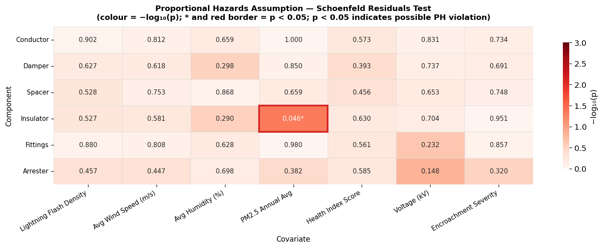
*รูปที่ 21 — Heatmap ของค่า p จากการทดสอบ Schoenfeld (อุปกรณ์ × ตัวแปรร่วม) เซลล์เดียวที่เข้าใกล้เกณฑ์คือ Insulator / PM2.5 / Heatmap of Schoenfeld test p-values (component × covariate); the only borderline cell is Insulator / PM2.5.*

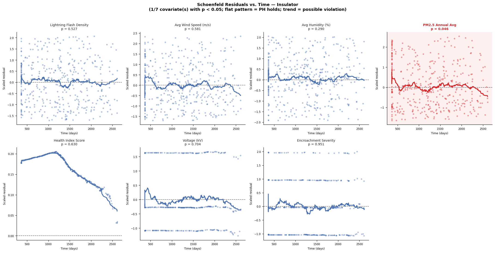
*รูปที่ 22 — Schoenfeld residuals เทียบกับเวลา สำหรับ Insulator (กรณีที่ใกล้เส้นนัยสำคัญที่สุด) เส้น smoother ที่แบนราบยืนยันว่าไม่มีแนวโน้มตามเวลาที่มีนัยสำคัญหลังแก้ไขการทดสอบหลายครั้ง / Scaled Schoenfeld residuals vs. time for Insulator (the most borderline case); the flat smoother confirms no meaningful time trend after multiple-testing correction.*

---

### 8.7 บทสรุปและการเชื่อมโยงสู่ Phase ถัดไป / Synthesis & Link to Next Phase

Cox PH เปลี่ยนการศึกษาจาก "เวลาเพียงอย่างเดียว" ไปสู่ **"ปัจจัยขับเคลื่อนความเสี่ยง"** ได้สำเร็จ และให้ข้อสรุปเชิงปฏิบัติการที่ชัดเจน:

1. **Health Index คือปัจจัยหลักสากล** — HI_score_last ทรงพลังในทุกอุปกรณ์ (HR 1.65–2.22) และผ่าน PH ทุกกรณี เป็นสัญญาณเตือนภัยที่น่าเชื่อถือที่สุดสำหรับการบำรุงรักษาเชิงป้องกัน
2. **ปัจจัยสิ่งแวดล้อมเฉพาะอุปกรณ์** — PM2.5/ความชื้นต่อ Insulator และฟ้าผ่าต่อ Arrester ชี้เป้าหมายการลงทุน (เช่น ฉนวนทนมลพิษในพื้นที่ฝุ่นสูง, การป้องกันฟ้าผ่าในพื้นที่ฟ้าผ่าหนาแน่น)
3. **แบบจำลองเชื่อถือได้** — C-index ดีถึงดีเยี่ยม (0.69–0.91) และสมมติฐาน PH เป็นจริง

อย่างไรก็ตาม Cox ตอบเพียงว่า *"หน่วยใดมีความเสี่ยงสูงกว่า ณ ตอนนี้ (which units are at higher RISK RIGHT NOW)"* ผ่านอัตราส่วนอันตราย แต่ **ไม่ให้คำทำนายเวลารอดชีวิตรายหน่วยโดยตรง** เพราะ baseline hazard $h_0(t)$ ไม่ถูกกำหนดรูปแบบ

นี่คือสะพานสู่ **Phase 7 — Weibull AFT Model** ซึ่งกำหนดรูปแบบ baseline ให้ชัดเจน (parametric) และเปลี่ยนคำถามไปสู่ *"แต่ละปัจจัยเพิ่มหรือลด **อายุการใช้งาน (LIFE)** เท่าไร?"* ผ่าน **Time Ratio / Acceleration Factor** ทำให้สามารถทำนายเวลารอดและ **Remaining Useful Life (RUL)** รายหน่วยได้ ซึ่งจำเป็นต่อการจัดลำดับความสำคัญการบำรุงรักษา (priority maintenance list)

---

# PART B — Individual-Level Analysis / การวิเคราะห์ระดับรายชิ้น

ส่วนนี้เปลี่ยนมุมมองจากการวิเคราะห์ระดับกลุ่ม (population-level: KM, Nelson-Aalen, hazard, model selection) ไปสู่การวิเคราะห์ระดับรายชิ้นส่วน (individual-level) โดยอาศัยแบบจำลองที่มี covariate เพื่อตอบคำถามเชิงปฏิบัติการสองข้อ คือ (1) ปัจจัยใดเร่ง/ชะลอการเสื่อมสภาพ และ (2) อุปกรณ์แต่ละชิ้นเหลืออายุการใช้งานเท่าใด (Remaining Useful Life)

---

## 9. Phase 7 — Weibull AFT Model & Remaining Useful Life / แบบจำลอง Weibull AFT และอายุการใช้งานคงเหลือ

### 9.1 วัตถุประสงค์และความต่างจาก Cox / Purpose & contrast with Cox

แบบจำลอง Accelerated Failure Time (AFT) สร้างแบบจำลอง **เวลาการอยู่รอด (survival time) โดยตรง** ไม่ใช่ hazard rate แบบ Cox PH จุดนี้คือความแตกต่างเชิงแนวคิดที่สำคัญ

| | Cox PH | Weibull AFT |
|---|---|---|
| สร้างแบบจำลองของ | hazard rate (อัตราเสี่ยง) | survival time (เวลาอยู่รอด) |
| ค่าหลักที่รายงาน | Hazard Ratio (HR) | Time Ratio / Acceleration Factor (TR=AF) |
| คำถามที่ตอบ | "ชิ้นใดเสี่ยง **มากกว่า ณ ตอนนี้**?" | "covariate แต่ละตัวเพิ่ม/ลด **อายุ** เท่าใด?" |
| การใช้งานปลายทาง | จัดอันดับความเสี่ยง | ทำนาย RUL รายชิ้น (per-unit) |

เพราะ AFT ทำนายเวลาการอยู่รอดโดยตรง จึงเป็นรากฐานที่ทำให้สามารถคำนวณ **RUL รายชิ้น** ได้ รูปแบบสมการ Weibull AFT คือ

$$\log(T) = \beta_0 + \beta^\top x + \sigma \cdot \varepsilon, \qquad S(t\mid x) = \exp\!\big(-(t\cdot\lambda(x))^{\rho}\big)$$

โดย lambda_ sub-model เข้ารหัสผลของ covariate บน (log) scale parameter และ rho_ เป็น shape sub-model (ค่าคงที่ intercept เท่านั้นโดย default)

### 9.2 การเตรียมข้อมูล / Data preparation

ใช้ pipeline การ standardise และ covariate ชุดเดียวกับ Phase 6 (Cox) ทุกประการ โดยเรียกใช้ `prepare_cox_data` ซ้ำ (ดู `src/aft_model.py` บรรทัด 62) เพื่อให้ผลลัพธ์เทียบกันได้โดยตรง

- **7 covariates (z-score standardised):** `lightning_flash_density`, `avg_wind_speed_ms`, `avg_humidity_pct`, `pm25_annual_avg`, `HI_score_last`, `encroachment_severity_enc` (ordinal 0–3), `voltage_kv`
- **โมเดล:** `WeibullAFTFitter(penalizer=0.1)` แยกฟิตรายชิ้นส่วน (per-component) ผ่าน `fit_aft_by_component`

### 9.3 Time Ratio / Acceleration Factor

TR = AF = exp(coef) ตีความ **ต่อการเปลี่ยน 1 ค่าเบี่ยงเบนมาตรฐาน (1 SD)**

- **AF < 1** → เร่งการเสื่อม (accelerates failure, ลดอายุ)
- **AF > 1** → ชะลอการเสื่อม (decelerates failure, เพิ่มอายุ)
- **AF = 1** → ไม่มีผล

ผลลัพธ์มีนัยสำคัญ (significant, p < 0.05) ทั้งหมด **9/42 combinations** และ **ทั้ง 9 ตัวมี AF < 1 (เร่งการเสื่อมทั้งหมด ไม่มีตัวใดชะลอ)** ตรวจสอบจาก `outputs/tables/aft_time_ratios.csv` และ `aft_acceleration_factors.csv`

| Component | Covariate | coef | AF (TR) | 95% CI | p | Effect |
|---|---|---|---|---|---|---|
| Conductor | Health Index Score | −0.5537 | **0.575** | 0.513–0.644 | <0.0001 | เร่งการเสื่อม |
| Damper | Health Index Score | −0.6841 | **0.505** | 0.442–0.576 | <0.0001 | เร่งการเสื่อม |
| Spacer | Health Index Score | −0.6425 | **0.526** | 0.468–0.591 | <0.0001 | เร่งการเสื่อม |
| Insulator | Health Index Score | −0.7464 | **0.474** | 0.411–0.547 | <0.0001 | เร่งการเสื่อม |
| Fittings | Health Index Score | −0.5635 | **0.569** | 0.508–0.638 | <0.0001 | เร่งการเสื่อม |
| Arrester | Health Index Score | −0.8178 | **0.441** | 0.376–0.518 | <0.0001 | เร่งการเสื่อม |
| Insulator | PM2.5 Annual Avg | −0.1839 | **0.832** | 0.778–0.890 | <0.0001 | เร่งการเสื่อม |
| Insulator | Avg Humidity (%) | −0.1395 | **0.870** | 0.811–0.933 | 0.0001 | เร่งการเสื่อม |
| Arrester | Lightning Flash Density | −0.1146 | **0.892** | 0.843–0.944 | 0.0001 | เร่งการเสื่อม |

**ตีความ:** `HI_score_last` เป็นปัจจัยเด่นในทุกชิ้นส่วน — การเพิ่มขึ้น 1 SD ของ Health Index ลดเวลาอยู่รอดลงเหลือ 44–57% Arrester ไวต่อ HI มากที่สุด (AF=0.441) ส่วนปัจจัยสิ่งแวดล้อมเฉพาะตัว ได้แก่ PM2.5 และความชื้นมีผลต่อ Insulator (สอดคล้องกลไก flashover/การปนเปื้อนพื้นผิว) และฟ้าผ่ามีผลต่อ Arrester (อุปกรณ์ที่ออกแบบมารับ surge โดยตรง)

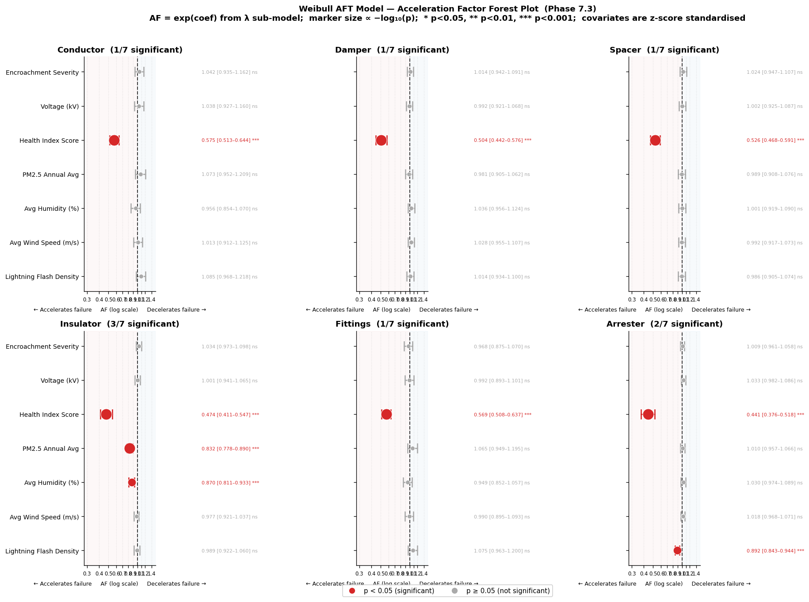
*รูปที่ 23 — Forest plot ของ Acceleration Factor รายชิ้นส่วน (2×3 grid): สีแดง = significant (p<0.05), สีเทา = not significant / AF forest plot per component.*

### 9.4 สรุปคุณภาพแบบจำลอง / AFT model summary

ตรวจสอบจาก `outputs/tables/aft_model_summary.csv`

| Component | AIC | LLV | C-index | rho_ intercept |
|---|---|---|---|---|
| Conductor | 1795.56 | −888.78 | **0.921** | 0.403 |
| Fittings | 2222.68 | −1102.34 | **0.898** | 0.399 |
| Spacer | 4254.38 | −2118.19 | **0.802** | 0.437 |
| Damper | 5161.17 | −2571.58 | **0.754** | 0.418 |
| Insulator | 7676.82 | −3829.41 | **0.739** | 0.447 |
| Arrester | 9227.96 | −4604.98 | **0.702** | 0.575 |

**rho_ intercept อยู่ในช่วง 0.40–0.58** หมายเหตุ: ค่านี้คือ log-shape parameterisation ของ AFT ใน lifelines (ρ ที่นี่ < 1) ซึ่งสอดคล้องเชิงทิศทางกับ wear-out behaviour ที่พบในเฟสก่อนหน้า (kernel hazard และ Weibull shape) C-index สูงสุดที่ Conductor (0.921) และต่ำสุดที่ Arrester (0.702) สะท้อนว่า Arrester มีอัตราการเสีย/ความผันแปรสูงสุด ทำให้ทำนายยากที่สุด

### 9.5 อัลกอริทึมทำนาย RUL / RUL prediction algorithm

(`predict_rul`, `src/aft_model.py` บรรทัด 332–397)

1. ทำนาย **median survival time** ต่อชิ้น ตาม covariate profile ของชิ้นนั้น (`predict_median`) — เลือก median เพราะ robust กว่า mean ในข้อมูลที่ censoring สูง
2. `RUL_days = max(0, predicted_lifetime_days − maintenance_period_days)` (clip ที่ 0)
3. `RUL_years = RUL_days / 365`

**Risk categories:**

| หมวด | เกณฑ์ RUL |
|---|---|
| Critical | < 365 วัน |
| Warning | 365–730 วัน |
| Monitor | 730–1460 วัน |
| Healthy | ≥ 1460 วัน |

### 9.6 การกระจาย RUL และหมวดความเสี่ยง / RUL distribution & risk breakdown

ตรวจสอบจาก `outputs/tables/rul_risk_breakdown.csv` และ `rul_summary_by_component.csv`

| Component | Median RUL | Critical | Warning | Monitor | Healthy |
|---|---|---|---|---|---|
| Conductor | ~42.3 ปี (15451 วัน) | 0% | 0% | 0% | **100%** |
| Fittings | ~32.9 ปี (12002 วัน) | 0% | 0% | 0% | **100%** |
| Spacer | ~10.8 ปี (3934 วัน) | 0% | 0% | 1.8% | 98.2% |
| Damper | ~8.1 ปี (2958 วัน) | 0% | 0% | 6.6% | 93.4% |
| Insulator | ~4.8 ปี (1751 วัน) | **6.9%** | 10.3% | 24.0% | 58.8% |
| Arrester | ~3.1 ปี (1115 วัน) | **17.1%** | 16.5% | 26.8% | 39.6% |

**ตีความ:** Conductor และ Fittings เป็น Healthy 100% สอดคล้องกับอัตราการเสียที่ต่ำมาก (4.9% และ 6.1%) ส่วน Arrester มีสัดส่วน Critical+Warning รวม 33.6% สูงสุด ตรงกับอัตราการเสียที่สังเกตได้ 29.5% ลำดับความเร่งด่วนเรียงตาม median RUL: Arrester < Insulator < Damper < Spacer < Fittings < Conductor

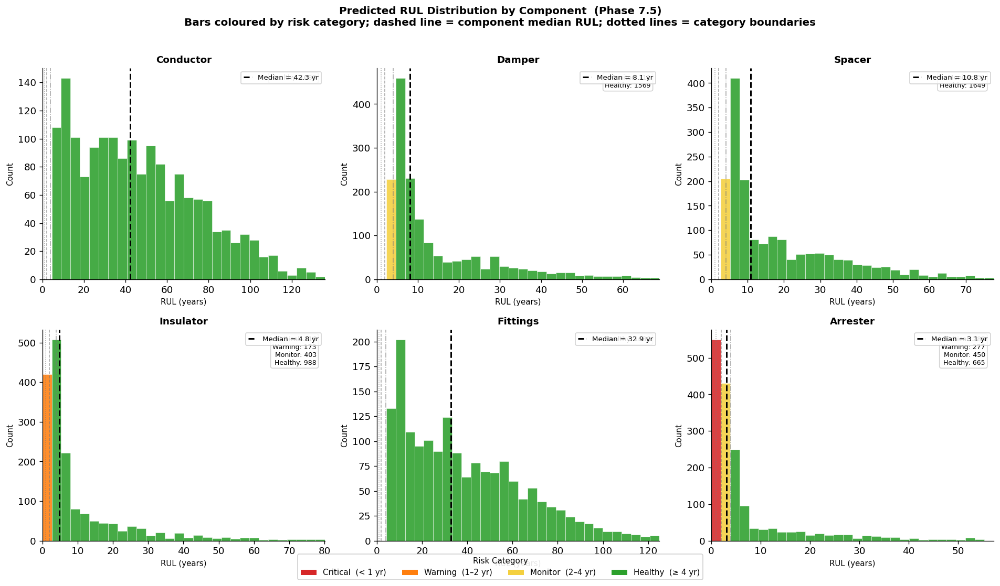
*รูปที่ 24 — ฮิสโทแกรม RUL_years รายชิ้นส่วน (2×3): แท่งระบายสีตามหมวดความเสี่ยง เส้นประ = median / RUL histograms coloured by risk category.*

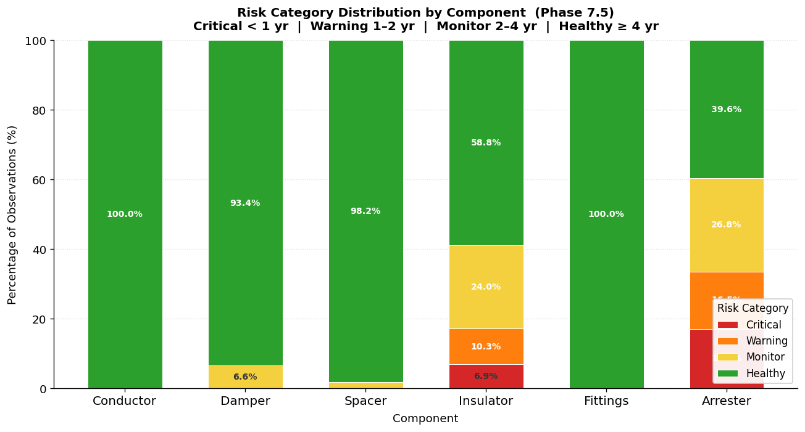
*รูปที่ 25 — Stacked 100% bar chart: Critical=แดง, Warning=ส้ม, Monitor=เหลือง, Healthy=เขียว / 100% stacked bar of risk categories.*

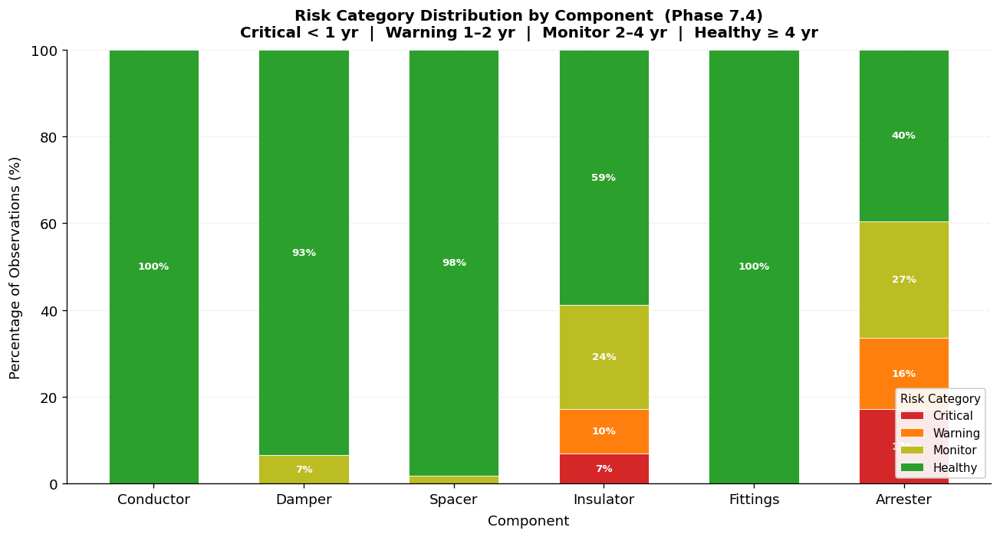
*รูปที่ 26 — สรุปจำนวนและสัดส่วนหมวดความเสี่ยงต่อชิ้นส่วน / Risk-category counts and percentages per component.*

### 9.7 รายการบำรุงรักษาเร่งด่วน / Priority maintenance list

(`generate_priority_list`) ตรวจสอบจาก `outputs/tables/priority_maintenance_list.csv` — **404 Critical units (4.0% ของ 10,080)**

| มิติ | รายละเอียด |
|---|---|
| ชิ้นส่วน | Arrester 288 + Insulator 116 |
| ภูมิภาค | Northeast 184, North 132, Central 61, South 27 |
| Health Index | ~98.3% เป็น HI5 (HI_score เฉลี่ย = 4.998) |
| Top-20 เร่งด่วนสุด | มาจาก LINE-NE2 (Northeast) ทั้งหมด |

ตัวอย่าง 8 แถวแรก (เรียงตาม RUL_days น้อยสุดก่อน):

| span_id | line_id | component | install_date | age (days) | HI | HI_class | RUL_days | pred_life (days) | lightning | region |
|---|---|---|---|---|---|---|---|---|---|---|
| SP-00356 | LINE-NE2 | Arrester | 2018-10-15 | 2359 | 5.0 | HI5 | 0.0 | 2249.7 | 21.70 | Northeast |
| SP-00289 | LINE-NE2 | Insulator | 2019-09-07 | 2032 | 5.0 | HI5 | 0.0 | 2001.5 | 27.92 | Northeast |
| SP-00290 | LINE-NE2 | Insulator | 2018-04-29 | 2528 | 5.0 | HI5 | 0.0 | 2156.3 | 29.28 | Northeast |
| SP-00293 | LINE-NE2 | Arrester | 2018-03-02 | 2586 | 5.0 | HI5 | 0.0 | 2291.8 | 21.87 | Northeast |
| SP-00296 | LINE-NE2 | Arrester | 2018-02-05 | 1991 | 5.0 | HI5 | 0.0 | 1951.6 | 29.30 | Northeast |
| SP-00303 | LINE-NE2 | Arrester | 2018-01-08 | 2639 | 5.0 | HI5 | 0.0 | 1947.2 | 29.84 | Northeast |
| SP-00305 | LINE-NE2 | Arrester | 2019-08-04 | 2066 | 5.0 | HI5 | 0.0 | 2039.0 | 25.94 | Northeast |
| SP-00306 | LINE-NE2 | Insulator | 2018-06-15 | 2481 | 5.0 | HI5 | 0.0 | 2382.1 | 21.25 | Northeast |

> **⚠️ ข้อควรระวัง — Artifact ของข้อมูลจำลอง / Simulated-data artifact**
> การที่ Critical units เกือบทั้งหมด (~98%) เป็น **HI5** เป็นผลจากธรรมชาติของข้อมูลจำลอง ไม่ใช่พฤติกรรมที่คาดในงานจริง กลไกคือ ชิ้นส่วน HI สูงที่อยู่บนสายฟ้าผ่าหนาแน่น (LINE-NE2 ครอง top-20) มี predicted lifetime สั้น เพราะใน AFT ค่า `HI_score_last` สูง **เร่งการเสื่อม** (AF<1) ทำให้ predicted median lifetime ต่ำกว่าอายุปัจจุบัน → RUL=0 → Critical **ในงานจริง** Critical units มักมี HI **ต่ำ** (อุปกรณ์ที่เสื่อมจริงจะมีสุขภาพต่ำ) จึงควรตีความรายการนี้ในเชิงโครงสร้างเมธอด ไม่ใช่ข้อสรุปทางวิศวกรรมโดยตรง

---

## 10. Cox PH vs Weibull AFT — Interplay / การเปรียบเทียบ Cox PH กับ Weibull AFT

(`src/model_comparison.py`) ตรวจสอบจาก `outputs/tables/cox_vs_aft_comparison.csv`

### 10.1 Concordance Index

**AFT เอาชนะ Cox ทั้ง 6 ชิ้นส่วน** (Δ +0.003 ถึง +0.013) แม้ส่วนต่างจะเล็ก แต่สม่ำเสมอทุกชิ้น

| Component | Cox C | AFT C | Δ |
|---|---|---|---|
| Conductor | 0.910 | **0.921** | +0.011 |
| Fittings | 0.885 | **0.898** | +0.013 |
| Spacer | 0.795 | **0.802** | +0.007 |
| Damper | 0.751 | **0.754** | +0.003 |
| Insulator | 0.735 | **0.739** | +0.004 |
| Arrester | 0.694 | **0.702** | +0.008 |

(ค่าใน CSV: Conductor 0.0113, Fittings 0.0129, Spacer 0.0065, Damper 0.0034, Insulator 0.0042, Arrester 0.0077 — ปัดเป็นทศนิยม 3 ตำแหน่งตามตาราง)

### 10.2 ความสอดคล้องของ covariate / Covariate agreement

- **9/42 combinations มีนัยสำคัญใน BOTH (ทั้งสองโมเดล)**
- **ZERO กรณี "Cox only" หรือ "AFT only"** — ทั้งสองโมเดลตั้งธง (flag) ชุด covariate เดียวกันเป๊ะ
- ทุก covariate ที่มีนัยสำคัญ **สอดคล้องเชิงทิศทาง (direction_consistent = True)**: HR > 1 ⟺ AF < 1 (เพิ่มความเสี่ยง = ลดอายุ)

9 ตัวที่ตรงกันคือ HI_score_last ทั้ง 6 ชิ้นส่วน + Insulator (PM2.5, Humidity) + Arrester (Lightning) — ตรงกับ 9 significant AFs ในหัวข้อ 9.3 พอดี

### 10.3 ความสัมพันธ์เชิงทฤษฎีและคู่มือการเลือกใช้ / Relationship & usage guide

ความสัมพันธ์ระหว่างสองโมเดลสำหรับ Weibull โดยประมาณคือ

$$\text{HR} \approx \text{AF}^{-\rho}, \qquad \rho \approx 1.5\text{–}1.8 \text{ (สำหรับชุดข้อมูลนี้)}$$

จึงทำให้ HR>1 และ AF<1 เกิดคู่กันเสมอ และเป็นเหตุผลว่าทำไมสองโมเดลให้ชุด covariate ที่มีนัยสำคัญเหมือนกัน

**เมื่อใดควรใช้แบบใด / When to use which:**

| ใช้ Cox PH เมื่อ | ใช้ Weibull AFT เมื่อ |
|---|---|
| ถามว่า "ชิ้นใดเสี่ยง **ณ ตอนนี้**" | ถามว่า "covariate เพิ่ม/ลด **อายุ** เท่าใด" |
| จัดอันดับความเสี่ยงเชิงสัมพัทธ์ (HR) | ทำนายเวลาอยู่รอด/RUL รายชิ้น (AF) |
| ไม่ต้องสมมติรูปการแจกแจง (semi-parametric) | ต้องการค่าทำนายเป็นวัน/ปี (parametric, fully predictive) |
| วางแผนจัดลำดับการตรวจ | วางแผนตารางเปลี่ยนอุปกรณ์และงบประมาณล่วงหน้า |

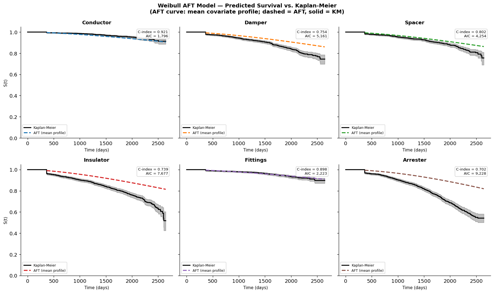
*รูปที่ 27 — การทำนาย S(t) ด้วย AFT (mean-profile) เทียบกับเส้น Kaplan-Meier รายชิ้นส่วน (2×3) / AFT mean-profile prediction vs KM.*

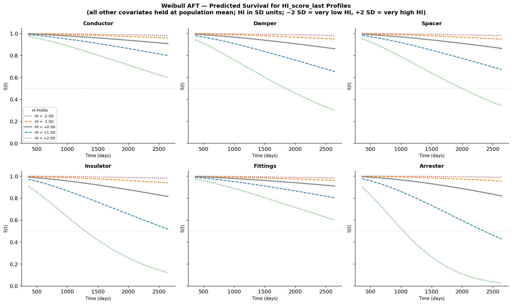
*รูปที่ 28 — เส้น S(t) ที่ AFT ทำนายเมื่อ HI_score_last อยู่ที่ ±2, ±1, 0 SD รายชิ้นส่วน — แสดงผลเชิงปริมาณของ Health Index ต่ออายุการใช้งาน / AFT predicted survival at varying HI levels.*

**สรุป Part B:** AFT ให้ความสามารถทำนายระดับรายชิ้น (RUL, predicted lifetime) ที่ Cox ทำไม่ได้โดยตรง ขณะที่ทั้งสองโมเดลยืนยันข้อค้นพบเดียวกันว่า **Health Index คือปัจจัยขับเคลื่อนหลัก** ในทุกชิ้นส่วน เสริมด้วยฟ้าผ่า (Arrester) และมลพิษ/ความชื้น (Insulator) — ให้ผลที่สอดคล้องและเสริมกัน (consistent and complementary)

---

# บทสังเคราะห์ / Synthesis

## 11. อภิปรายผล / Discussion

### 11.1 กลไก wear-out ได้รับการยืนยัน ⇒ การบำรุงรักษาเชิงป้องกันตามเวลามีเหตุผลรองรับ / Wear-out confirmed ⇒ time-based preventive maintenance is justified

หลักฐานสองสายมาบรรจบกันอย่างหนักแน่นว่าความเสียหายของอุปกรณ์สายส่งเป็นแบบ **wear-out** (เสื่อมสภาพตามอายุ) ไม่ใช่แบบสุ่ม (random/constant-hazard):

1. **เชิงนอนพาราเมตริก (Phase 4):** Epanechnikov kernel hazard ของทุกอุปกรณ์มีรูปร่าง **เพิ่มขึ้นแบบ monotonic** (ดูรูปที่ 8) สอดคล้องกับ cumulative hazard ของ Nelson-Aalen ที่เว้าขึ้น (concave-up)
2. **เชิงพาราเมตริก (Phase 5):** Weibull shape parameter $\rho \in [1.689, 1.944]$ — **มากกว่า 1 ทุกอุปกรณ์** ($\rho>1 \Leftrightarrow$ increasing hazard) และที่สำคัญที่สุด **Exponential (constant hazard, $\rho=1$) ถูกปฏิเสธในทุกอุปกรณ์** ด้วย ΔAIC ระหว่าง 26.71–206.25 (≫ 10 ตามเกณฑ์ Burnham & Anderson)

ผลลัพธ์เชิงตรรกะคือ: **ความเสี่ยงเพิ่มขึ้นเมื่ออุปกรณ์อายุมากขึ้น** ดังนั้นการบำรุงรักษาเชิงป้องกันตามรอบเวลา (time-based preventive maintenance) จึง **มีเหตุผลทางสถิติรองรับ** — ตรงข้ามกับกรณี constant hazard ที่การเปลี่ยนตามอายุจะไม่ช่วยลดความเสี่ยงเลย พารามิเตอร์ Weibull ($\lambda, \rho$) รายอุปกรณ์จึงสามารถใช้กำหนดรอบเปลี่ยนทดแทนเชิงป้องกัน (preventive-replacement interval) ได้โดยตรง / Both non-parametric (kernel) and parametric (Weibull $\rho>1$, Exponential rejected) evidence converge: failures are wear-out driven, statistically justifying time-based preventive maintenance.

### 11.2 `HI_score_last` คือตัวทำนายเด่นสากล / The Health Index is the single universal dominant predictor

ผลลัพธ์ที่โดดเด่นที่สุดของทั้งงานคือ **covariate ตัวเดียว — `HI_score_last` — แบกสัญญาณส่วนใหญ่ไว้** และมีนัยสำคัญใน **ทุกอุปกรณ์ทั้ง 6 ประเภท** ทั้งในมุมของความเสี่ยงและมุมของอายุ:

- **Cox PH:** HR = **1.65–2.22** (p < 1e-13 ทุกตัว) — HI แย่ลง 1 SD เพิ่มความเสี่ยงล้มเหลว 65–122%
- **Weibull AFT:** TR/AF = **0.44–0.58** — HI แย่ลง 1 SD ลดเวลาอยู่รอดเหลือ 44–58%

ทั้งสองมุมมองสอดคล้องกันเชิงทิศทางอย่างสมบูรณ์ (HR > 1 ⟺ AF < 1) และ HI **ผ่านสมมติฐาน PH ในทุกอุปกรณ์** (p > 0.39 ทุกกรณี) ทำให้ค่า HR ของมันน่าเชื่อถือสูง นัยเชิงปฏิบัติการชัดเจน: **Health Index เป็นตัวชี้นำล่วงหน้า (leading indicator) ที่เชื่อถือได้ที่สุดสำหรับการบำรุงรักษาเชิงพยากรณ์** การลงทุนในการเก็บและปรับปรุงคุณภาพ HI ให้ผลตอบแทนเชิงพยากรณ์สูงสุด / A single covariate, `HI_score_last`, dominates both models across all six components (Cox HR 1.65–2.22; AFT TR 0.44–0.58) and satisfies PH everywhere — it is the most reliable leading indicator.

### 11.3 ปัจจัยสิ่งแวดล้อมมีผลเฉพาะเจาะจงตามอุปกรณ์ / Environment matters component-specifically — and physically sensibly

นอกเหนือจาก HI แล้ว ปัจจัยสิ่งแวดล้อมที่มีนัยสำคัญ **จับคู่กับอุปกรณ์ตามกลไกความเสียหายเชิงฟิสิกส์อย่างชัดเจน**:

- **ฟ้าผ่า → Arrester** (Cox HR=1.22, AFT AF=0.89; p<1e-5) — กับดักเสิร์จ (surge arrester) มีหน้าที่รับพลังงานฟ้าผ่าโดยตรง การรับ surge ซ้ำ ๆ จึงเร่งการเสื่อม สอดคล้องกับ failure mode เด่น `lightning_damage` (233 เคส)
- **PM2.5 + ความชื้น → Insulator** (PM2.5 HR=1.28/AF=0.83; humidity HR=1.19/AF=0.87) — กลไก **pollution flashover**: ฝุ่นเกาะผิวฉนวนแล้วความชื้นทำให้เกิดการนำไฟฟ้าตามผิว สอดคล้องกับ failure mode `contamination_flashover` (113 เคส) ที่พบเฉพาะใน Insulator

ความสอดคล้องระหว่าง (failure mode เชิงพรรณนาใน Phase 2) ↔ (covariate ที่มีนัยสำคัญใน Phase 6–7) เป็นการ cross-validate ภายในที่ทรงพลัง — ผลทางสถิติไม่ใช่ artifact แต่สะท้อนฟิสิกส์ของความเสียหายจริง / Significant environmental covariates map onto components by physical failure mechanism (lightning→surge arrester; PM2.5+humidity→insulation flashover), cross-validating the descriptive failure-mode analysis.

### 11.4 ความผิดปกติเชิงภูมิภาค: Central แตกต่าง / Regional anomaly: Central is distinct

การทดสอบ log-rank แบบ pairwise (Phase 3) แสดงว่า **Central แตกต่างจากทุกภูมิภาคอื่นอย่างมีนัยสำคัญสูง** (p < 1e-7 ทุกคู่) ในขณะที่ **North, Northeast และ South แยกกันไม่ออกในเชิงสถิติ** (p = 0.318–0.672) ความแตกต่างนี้น่าจะถูกขับเคลื่อนโดยส่วนผสมของ covariate สิ่งแวดล้อมเฉพาะของ Central (เช่นมลพิษ/ความชื้น/ฟ้าผ่าในระดับที่ต่างออกไป) ซึ่งควรเป็นหัวข้อสำหรับการสืบสวนเชิงลึกต่อไป / Central differs sharply from all other regions (log-rank p < 1e-7), while NE/N/S are statistically indistinguishable — pointing to a Central-specific covariate mix worth investigating.

### 11.5 Cox เทียบ AFT: เสริมกัน ไม่ขัดกัน / Cox vs. AFT: complementary, not contradictory

สองโมเดล regression ให้ภาพที่ **สอดคล้องและเสริมกัน**:

- **ชุด covariate ที่มีนัยสำคัญเหมือนกันเป๊ะ** — 9/42 combinations มีนัยสำคัญใน **ทั้งสองโมเดล** โดยมี **ศูนย์กรณี "Cox-only" หรือ "AFT-only"** และทุกคู่สอดคล้องเชิงทิศทาง
- **AFT ให้ discrimination ดีกว่าเล็กน้อยแต่สม่ำเสมอ** — AFT ชนะ Cox ที่ C-index ทั้ง 6 อุปกรณ์ (Δ +0.003 ถึง +0.013)
- **AFT ให้ค่าทำนายที่นำไปใช้งานได้** — เวลาอยู่รอด/RUL รายชิ้น ซึ่ง Cox ทำไม่ได้โดยตรงเพราะ baseline hazard ไม่ถูกกำหนดรูป

ความสัมพันธ์เชิงทฤษฎี $\text{HR} \approx \text{AF}^{-\rho}$ (โดย $\rho \approx 1.5$–$1.8$ สำหรับชุดข้อมูลนี้) อธิบายว่าทำไมทั้งสองจึงตั้งธง covariate ชุดเดียวกันและสอดคล้องเชิงทิศทางเสมอ — Cox ตอบ *"หน่วยใดเสี่ยงกว่า ณ ตอนนี้?"* (HR, hazard) ส่วน AFT ตอบ *"แต่ละปัจจัยเพิ่ม/ลดอายุเท่าใด?"* (AF, survival time) / The two regression models flag identical significant covariates (9/42, zero exclusive cases) with consistent direction; AFT discriminates marginally better and yields actionable per-unit RUL, linked by $\text{HR}\approx\text{AF}^{-\rho}$.

### 11.6 ตรรกะการต่อยอดของแต่ละเฟส / How the phases build on one another

ระเบียบวิธีถูกออกแบบให้แต่ละเฟส **ป้อนผลให้เฟสถัดไปอย่างมีตรรกะ** (recap):

1. **Phase 2 (EDA)** ตรวจสอบ duration + event indicator และเปิดเผย censoring rate 84.65% → กำหนดทิศทางว่าต้องใช้ survival analysis
2. **Phase 3 (KM/NA)** ประมาณ S(t) และ H(t) เชิงประชากร; **NA increments** กลายเป็น input โดยตรงของ kernel hazard
3. **Phase 4 (kernel + parametric)** เปิดเผยรูปร่าง hazard = wear-out → จูงใจให้ใช้ parametric regression
4. **Phase 5 (AIC)** เลือก Weibull เป็น baseline เดียว → เป็นรากฐานของ AFT
5. **Phase 6 (Cox)** quantify ผล covariate ด้วย HR → ระบุ HI เป็นปัจจัยหลัก
6. **Phase 7 (AFT)** quantify AF + ทำนาย RUL รายชิ้น → ปิด loop กลับสู่ priority maintenance list

ลำดับนี้ทำให้ทุกข้อสรุปเชิงปฏิบัติการ (priority list) มีรากฐานเชิงสถิติที่ตรวจสอบได้ย้อนหลังไปถึงข้อมูลดิบ / Each phase feeds the next — from validated durations, to non-parametric shape, to AIC-selected Weibull, to covariate quantification (Cox), to per-unit RUL (AFT) — making the final priority list fully traceable.

---

## 12. ข้อจำกัด / Limitations

### 12.1 ข้อมูลจำลอง / Simulated data

ชุดข้อมูลนี้เป็น **ข้อมูลจำลอง (simulated)** ที่ถูกเสริมด้วย covariate สิ่งแวดล้อม/การใช้งานเพื่อ **สาธิตระเบียบวิธี (methodology demonstration)** ตามกรอบ Yang et al. (2022) ผลลัพธ์ทั้งหมด — โดยเฉพาะตัวเลขเชิงปฏิบัติการ เช่น RUL และ priority list — **ไม่ควรนำไปใช้ตัดสินใจปฏิบัติการจริงโดยตรง** แต่ควรถือเป็นการพิสูจน์ว่า pipeline ทำงานครบถ้วนและให้ผลที่ตีความได้ / All data are simulated; results demonstrate the methodology and must not drive real operational decisions as-is.

### 12.2 Artifact ของ HI5-Critical ในรายการเร่งด่วน / The HI5-Critical artifact in the priority list

Critical units เกือบทั้งหมด (~98.3%, ค่าเฉลี่ย HI = 4.998) เป็น **HI5** ซึ่ง **ตรงข้ามกับที่คาดในงานจริง** กลไกคือ: ในแบบจำลอง AFT ค่า `HI_score_last` สูง **เร่งการเสื่อม** (AF < 1) ทำให้ predicted median lifetime ของชิ้นส่วน HI สูง (โดยเฉพาะบนสาย LINE-NE2 ที่ฟ้าผ่าหนาแน่น) ต่ำกว่าอายุปัจจุบัน → RUL = 0 → Critical **ในงานจริง** Critical units มักมี HI **ต่ำ** (อุปกรณ์ที่เสื่อมจริงจะวัด HI ได้ต่ำ) ดังนั้นรายการนี้ต้องตีความในเชิง **โครงสร้างของเมธอด** ไม่ใช่ข้อสรุปทางวิศวกรรม — เป็นผลจากทิศทางของความสัมพันธ์ในข้อมูลจำลอง ไม่ใช่ของแบบจำลองที่ผิดพลาด / The priority list is dominated by HI5 units, the reverse of real operations: in the model high HI accelerates failure, so high-HI units exceed predicted lifetime first. Interpret structurally, not as an engineering verdict.

### 12.3 Censoring สูงและการพึ่งพา extrapolation / High censoring & reliance on extrapolation

อัตรา censoring สูงถึง **84.65%** ทำให้ **median survival ของทุกกลุ่ม = ∞** (ไม่มีกลุ่มใดที่ S(t) ลดต่ำกว่า 0.5 ในกรอบการศึกษา 2018–2025) ดังนั้น RUL ระยะยาว (เช่น Conductor ~42 ปี) จึงอาศัย **การ extrapolate ของแบบจำลอง parametric เกินช่วงข้อมูลที่สังเกตได้มาก** ค่าทำนายระยะไกลจึงมีความไม่แน่นอนสูงและไวต่อสมมติฐานรูปแบบการแจกแจง (distributional assumption) / 84.65% censoring means median survival is never reached; long-horizon RUL depends heavily on parametric extrapolation well beyond observed data and is correspondingly uncertain.

### 12.4 แบบจำลองรายอุปกรณ์และ shrinkage จาก penalizer / Per-component models & penalizer shrinkage

โมเดล Cox และ AFT ถูก fit **แยกรายอุปกรณ์ (per-component)** โดย **ไม่มี baseline ร่วม (shared baseline) และไม่มี frailty term** สำหรับ correlation ภายใน line/span/tower เดียวกัน ทำให้ไม่ได้คุม clustering effect ที่อาจมีอยู่ นอกจากนี้การใช้ **L2 penalizer = 0.1** เพื่อเสถียรภาพเชิงตัวเลข (จำเป็นเพราะ EPV ต่ำสุดเพียง ~11.7 ใน Conductor) ทำให้เกิด **shrinkage ของ HR/AF เข้าหา 1 เล็กน้อย** กล่าวคือ effect sizes ที่รายงานอาจ **อนุรักษ์นิยม (conservative)** เล็กน้อยเมื่อเทียบกับค่าจริง / Models are fit per component with no shared baseline or frailty for within-line/span clustering; the L2 penalizer (0.1) introduces slight shrinkage of HR/AF toward 1, making reported effects mildly conservative.

---

## 13. สรุปและข้อเสนอแนะ / Conclusions & Recommendations

โครงการนี้นำระเบียบวิธี survival analysis ของ Yang et al. (2022) มาประยุกต์ครบวงจร 7 เฟส ตั้งแต่ EDA จนถึง priority maintenance list และยืนยันว่า **ความเสียหายเป็นแบบ wear-out, Health Index เป็นปัจจัยขับเคลื่อนหลักสากล, และ Weibull AFT ให้ทั้ง discrimination ที่ดีที่สุดและค่าทำนาย RUL รายชิ้น** ข้อเสนอแนะเชิงปฏิบัติการที่นำไปดำเนินการได้ (actionable):

1. **กำหนดความถี่ตรวจสอบตามระดับความเสี่ยง / Risk-stratified inspection frequency** — เพิ่มความถี่การตรวจสอบสูงสุดสำหรับ **Arrester** (Critical+Warning รวม 33.6%) และ **Insulator** (17.2%) ซึ่งเป็นอุปกรณ์เสี่ยงสูงสุด ขณะที่ Conductor และ Fittings (Healthy 100%) สามารถยืดรอบตรวจสอบได้

2. **ใช้พารามิเตอร์ Weibull กำหนดรอบเปลี่ยนเชิงป้องกัน / Use Weibull parameters for preventive-replacement intervals** — เนื่องจาก $\rho > 1$ ทุกอุปกรณ์ (wear-out) ให้ใช้ characteristic life $\lambda$ และ shape $\rho$ รายอุปกรณ์ (เช่น Arrester $\lambda$=3326 / Conductor $\lambda$=9794) คำนวณรอบเปลี่ยนทดแทนที่ระดับ reliability เป้าหมาย

3. **เฝ้าติดตาม Health Index เป็นตัวชี้นำล่วงหน้า / Monitor HI as the leading indicator** — HI_score_last เป็นปัจจัยหลักในทุกอุปกรณ์ (HR 1.65–2.22) และผ่าน PH ทุกกรณี ควรลงทุนในระบบเก็บ/อัปเดต HI อย่างต่อเนื่องและตั้ง trigger การบำรุงรักษาตามระดับ HI

4. **ให้ความสำคัญกับ LINE-NE2 / Northeast (พื้นที่ฟ้าผ่าหนาแน่น) / Prioritise LINE-NE2 / Northeast lightning exposure** — top-20 หน่วยเร่งด่วนทั้งหมดมาจาก LINE-NE2 และ Northeast มี Critical units มากที่สุด (184) ควรพิจารณามาตรการป้องกันฟ้าผ่าเพิ่มเติม (เช่น เพิ่ม arrester rating, ปรับ shielding) ในพื้นที่นี้

5. **นำ AFT-based RUL scoring ไปใช้เชิงปฏิบัติการ / Deploy AFT-based RUL scoring operationally** — ใช้ pipeline `predict_rul` ให้คะแนน RUL และ risk category รายชิ้นเป็นรอบ (เช่น รายไตรมาส) เพื่อขับเคลื่อน priority list และวางแผนงบประมาณ/ตารางเปลี่ยนอุปกรณ์ล่วงหน้า (โดยปรับให้ HI สะท้อนสภาพจริงเพื่อหลีกเลี่ยง artifact ใน §12.2)

6. **สืบสวนปัจจัยขับเคลื่อนของภูมิภาค Central / Investigate Central-region drivers** — Central แตกต่างจากทุกภูมิภาคอย่างมีนัยสำคัญสูง ควรวิเคราะห์ส่วนผสม covariate เฉพาะของ Central เพื่อเข้าใจสาเหตุและออกแบบมาตรการเฉพาะพื้นที่

---

## ภาคผนวก / Appendix

### A. ดัชนีตารางผลลัพธ์ / Output Tables Index (`outputs/tables/`)

| ไฟล์ / File | คำอธิบาย / Description |
|---|---|
| `data_summary.csv` | N, events, censoring/event rate, สถิติ duration รายอุปกรณ์ / per-component duration statistics |
| `failure_mode_breakdown.csv` | ตาราง pivot อุปกรณ์ × failure mode / component × failure-mode pivot |
| `km_survival_summary.csv` | S(t) และ 95% CI ที่จุดเวลารายปี / KM survival & CI at yearly time points |
| `logrank_pairwise_component.csv` | ค่า p ของ log-rank รายคู่ (อุปกรณ์) / pairwise log-rank p-values (components) |
| `logrank_pairwise_region.csv` | ค่า p ของ log-rank รายคู่ (ภูมิภาค) / pairwise log-rank p-values (regions) |
| `goodness_of_fit.csv` | LLV + AIC รายโมเดล × อุปกรณ์ (เทียบเท่า Table 2) / fit statistics per model × component |
| `goodness_of_fit_annotated.csv` | เหมือนข้างบนพร้อมเครื่องหมาย ✓ โมเดลดีที่สุด / same with best-model annotation |
| `delta_aic_matrix.csv` | เมทริกซ์ ΔAIC (อุปกรณ์ × โมเดล) / ΔAIC matrix |
| `model_comparison.csv` | ตาราง long-form AIC/LLV พร้อม rank และ ΔAIC / long-form ranked AIC/LLV |
| `fitted_parameters.csv` | พารามิเตอร์ของแต่ละ distribution ที่ fit ได้ / fitted distribution parameters |
| `cox_hazard_ratios.csv` | HR, 95% CI, p รายตัวแปร × อุปกรณ์ (long form) / Cox HR long form |
| `cox_hr_detailed.csv` | เหมือนข้างบนพร้อม z-score และดาวนัยสำคัญ / Cox HR with z & significance stars |
| `cox_concordance.csv` | C-index รายอุปกรณ์ / Cox C-index per component |
| `ph_assumption_test.csv` | Schoenfeld test: test_statistic, p, violated รายตัวแปร × อุปกรณ์ / PH test results |
| `aft_time_ratios.csv` | TR, 95% CI, p รายตัวแปร × อุปกรณ์ (long form) / AFT time ratios long form |
| `aft_tr_detailed.csv` | เหมือนข้างบนพร้อม z-score และดาวนัยสำคัญ / AFT TR with z & significance stars |
| `aft_model_summary.csv` | AIC, LLV, C-index, rho_ intercept รายอุปกรณ์ / AFT model summary |
| `aft_acceleration_factors.csv` | AF, 95% CI, coef, p, sig, effect รายตัวแปร × อุปกรณ์ / acceleration factors |
| `rul_predictions.csv` | df เต็ม + predicted_lifetime_days, RUL_days, RUL_years, risk_category / full RUL predictions |
| `rul_summary_by_component.csv` | mean/median/std/min/max RUL รายอุปกรณ์ / RUL summary statistics |
| `rul_risk_breakdown.csv` | จำนวนและ % หมวดความเสี่ยงรายอุปกรณ์ / risk-category counts & percentages |
| `cox_vs_aft_comparison.csv` | CSV สองส่วน: concordance + ความสอดคล้องนัยสำคัญของ covariate / two-section Cox-vs-AFT comparison |
| `priority_maintenance_list.csv` | 404 Critical units เรียงตาม RUL_days น้อยสุด (11 คอลัมน์ปฏิบัติการ) / priority list (404 rows) |

### B. ดัชนีรูป / Figure Index (`outputs/figures/`)

| รูปที่ / Fig | ไฟล์ / File | คำอธิบาย / Caption |
|---|---|---|
| 1 | `eda_event_distribution.png` | การกระจายสถานะ event/censored / event vs. censored distribution |
| 2 | `eda_duration_boxplot.png` | Boxplot ของ duration รายอุปกรณ์ / duration boxplot by component |
| 3 | `fig4_duration_histogram_overall.png` | ฮิสโทแกรม duration ภาพรวม / overall duration histogram |
| 4 | `fig5_duration_histograms_by_component.png` | ฮิสโทแกรม duration รายอุปกรณ์ (2×3) / per-component duration histograms |
| 5 | `fig6_km_by_component.png` | เส้น KM รายอุปกรณ์ + numbers-at-risk / KM curves by component |
| 6 | `km_by_region.png` | เส้น KM รายภูมิภาค (2×2) / KM curves by region |
| 7 | `km_by_hi_class.png` | เส้น KM ตามชั้น Health Index / KM curves by HI class |
| 8 | `kernel_hazard_epanechnikov.png` | Kernel hazard (Epanechnikov) ทุกอุปกรณ์ / kernel hazard overlay |
| 9 | `hazard_overview_2x3.png` | ภาพรวม kernel vs. parametric (2×3) / hazard overview |
| 10 | `fig7_hazard_conductor.png` | Hazard Conductor: kernel + 5 parametric |
| 11 | `fig8_hazard_damper.png` | Hazard Damper: kernel + 5 parametric |
| 12 | `fig9_hazard_spacer.png` | Hazard Spacer: kernel + 5 parametric |
| 13 | `fig10_hazard_insulator.png` | Hazard Insulator: kernel + 5 parametric |
| 14 | `fig11_hazard_fittings.png` | Hazard Fittings: kernel + 5 parametric |
| 15 | `fig12_hazard_arrester.png` | Hazard Arrester: kernel + 5 parametric |
| 16 | `aic_comparison_faceted.png` | AIC bars รายอุปกรณ์ (faceted) / faceted AIC bars |
| 17 | `delta_aic_grouped.png` | ΔAIC grouped bar + เกณฑ์ B&A / grouped ΔAIC with thresholds |
| 18 | `model_aic_heatmap.png` | Heatmap AIC (model × component) |
| 19 | `cox_concordance.png` | C-index ของ Cox PH รายอุปกรณ์ / Cox concordance per component |
| 20 | `cox_forest_plot.png` | Forest plot ของ HR ± 95% CI (2×3) / Cox HR forest plot |
| 21 | `ph_assumption_heatmap.png` | Heatmap ค่า p ของการทดสอบ PH / PH test p-value heatmap |
| 22 | `ph_schoenfeld_insulator.png` | Schoenfeld residuals — Insulator (กรณีใกล้เกณฑ์ที่สุด) |
| 23 | `aft_forest_plot.png` | Forest plot ของ Acceleration Factor (2×3) / AF forest plot |
| 24 | `rul_distribution.png` | ฮิสโทแกรม RUL_years รายอุปกรณ์ / RUL distribution |
| 25 | `risk_category_by_component.png` | Stacked 100% bar ของหมวดความเสี่ยง / risk-category stacked bar |
| 26 | `rul_risk_breakdown.png` | สรุปจำนวน/% หมวดความเสี่ยง / RUL risk breakdown |
| 27 | `aft_vs_km.png` | AFT mean-profile vs. KM (2×3) |
| 28 | `aft_hi_profiles.png` | S(t) ที่ AFT ทำนายตามระดับ HI (±2,±1,0 SD) / AFT HI profiles |

*หมายเหตุ: รูป Schoenfeld residuals ของอุปกรณ์อื่น (`ph_schoenfeld_{conductor,damper,spacer,fittings,arrester}.png`) ถูกสร้างเพิ่มเติมเป็นภาคผนวกการวินิจฉัย โดยรายงานหลักฝัง Insulator (รูปที่ 22) ในฐานะกรณีที่ใกล้เกณฑ์ที่สุด / Schoenfeld residual plots for the remaining components are produced as diagnostic appendices; the main report embeds Insulator as the most borderline case.*

### C. สูตรอ้างอิงของแต่ละโมเดล / Per-Model Math Reference

**Kaplan-Meier (product-limit estimator):**
$$\hat{S}(t) = \prod_{t_i \le t}\left(1 - \frac{d_i}{n_i}\right)$$
โดย $d_i$ = จำนวน event และ $n_i$ = จำนวน at-risk ณ เวลา $t_i$; ใช้ Greenwood formula สำหรับ variance/CI

**Nelson-Aalen (cumulative hazard):**
$$\hat{H}(t) = \sum_{t_i \le t}\frac{d_i}{n_i}, \qquad \hat{S}(t) = e^{-\hat{H}(t)}$$

**Kernel hazard (Epanechnikov smoother):**
$$\hat{h}(t) = \frac{1}{b}\sum_i K\!\left(\frac{t-t_i}{b}\right)\Delta\hat{H}(t_i), \qquad K(u) = \tfrac{3}{4}(1-u^2)\,\mathbb{1}(|u|\le 1)$$
bandwidth $b$ เลือกด้วย LSCV (least-squares cross-validation)

**Weibull** (scale $\lambda$, shape $\rho$):
$$S(t) = \exp\!\big(-(t/\lambda)^{\rho}\big), \qquad h(t) = \frac{\rho}{\lambda}\left(\frac{t}{\lambda}\right)^{\rho-1}$$
$\rho>1$ increasing, $\rho=1$ constant, $\rho<1$ decreasing hazard

**Exponential** (rate $\lambda$; Weibull กรณี $\rho=1$):
$$S(t) = e^{-\lambda t}, \qquad h(t) = \lambda \;\; (\text{constant, memoryless})$$

**Log-logistic** (scale $\alpha$, shape $\beta$):
$$S(t) = \frac{1}{1+(t/\alpha)^{\beta}}, \qquad h(t) = \frac{(\beta/\alpha)(t/\alpha)^{\beta-1}}{1+(t/\alpha)^{\beta}}$$
hazard แบบ unimodal (เพิ่มแล้วลด) เมื่อ $\beta>1$

**Log-normal** ($\mu,\sigma$):
$$S(t) = 1-\Phi\!\left(\frac{\ln t-\mu}{\sigma}\right), \qquad h(t) = \frac{f(t)}{S(t)}$$
โดย $f(t)$ คือ pdf ของ log-normal; hazard unimodal

**Generalized-gamma** ($\mu, \sigma, \lambda$; superfamily ครอบ Weibull/log-normal/gamma/exponential):
$$\text{เมื่อ } \lambda\to 0 \Rightarrow \text{log-normal}, \quad \lambda=\sigma \Rightarrow \text{Weibull}, \quad \lambda=\sigma=1 \Rightarrow \text{exponential}$$
ยืดหยุ่นสูงสุดด้วย 3 พารามิเตอร์ — best fit ของ Insulator

**Cox proportional hazards (semi-parametric):**
$$h(t\mid \mathbf{x}) = h_0(t)\exp(\boldsymbol{\beta}^\top\mathbf{x}), \qquad \text{HR}_j = e^{\beta_j}$$
ประมาณ $\boldsymbol{\beta}$ ด้วย **partial likelihood** (ไม่ต้องระบุ $h_0(t)$):
$$L(\boldsymbol{\beta}) = \prod_{i:\,\delta_i=1}\frac{\exp(\boldsymbol{\beta}^\top\mathbf{x}_i)}{\sum_{j\in R(t_i)}\exp(\boldsymbol{\beta}^\top\mathbf{x}_j)}$$
โดย $R(t_i)$ = risk set ณ เวลา $t_i$

**Weibull AFT (accelerated failure time):**
$$\log T = \beta_0 + \boldsymbol{\beta}^\top\mathbf{x} + \sigma\varepsilon, \qquad S(t\mid\mathbf{x}) = \exp\!\big(-(t\cdot\lambda(\mathbf{x}))^{\rho}\big)$$
Time Ratio / Acceleration Factor $\text{AF}_j = e^{\beta_j}$ (AF<1 เร่งการเสื่อม, AF>1 ชะลอ); สัมพันธ์กับ Cox โดย $\text{HR}\approx\text{AF}^{-\rho}$

---

*สิ้นสุดรายงาน / End of report.*
